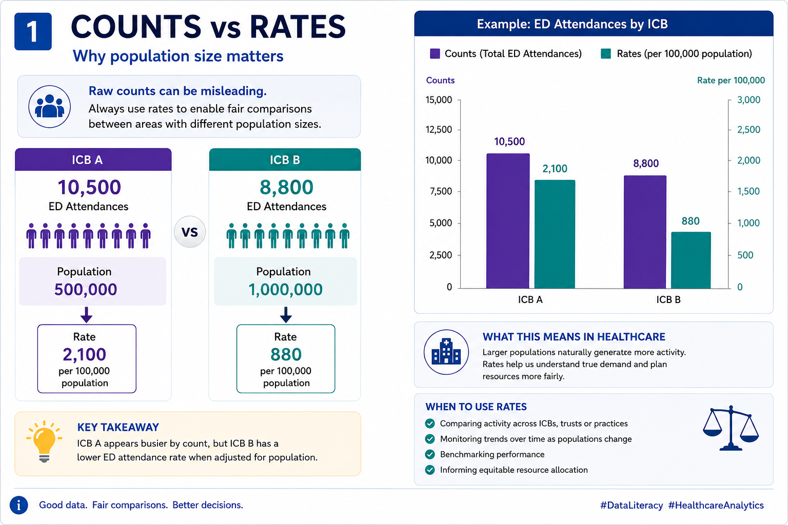
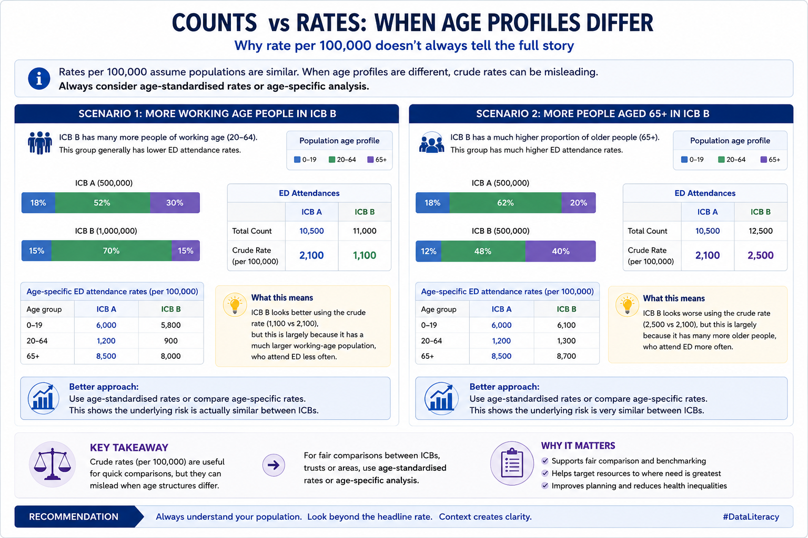
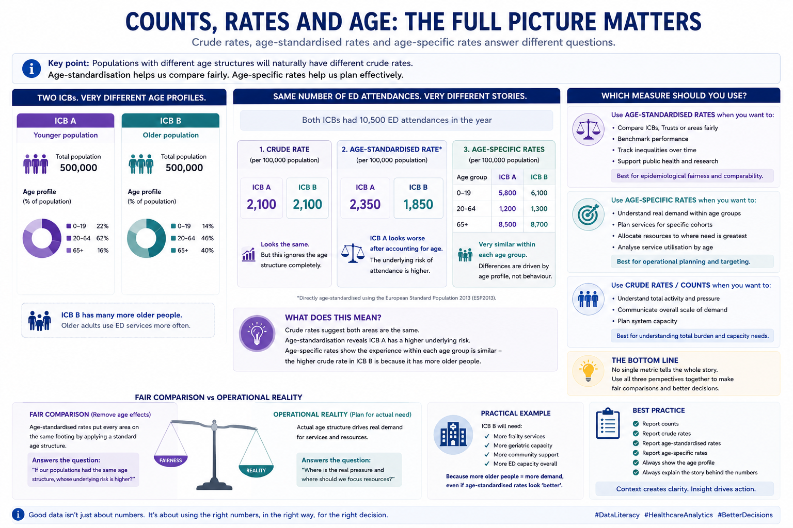
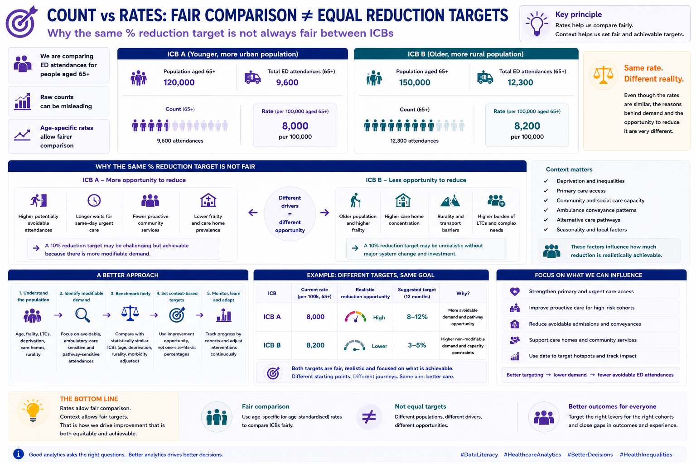

# Module 1 - Counts vs Rates

 Counts are an important metric to gain a feel for volumes of activity or patients. However they are not useful when comparing with other geographical areas.

 Rates (often per 10,000 or 100,000) are often referred to as "Crude Rates" and offer a fairer way for comparison.




# Consideration 1

   What about the scenario when age profiles are different amongst geographical areas?
    
   For example there is proportionally more working age people in ICB B compared to ICB A or when more people aged 65 and over
   in ICB B compared to ICB A. 
    



 # When it is important to consider switching to Age Standardised Rates

  Whether to switch or not depends on the purpose of the comparison and what question you are trying to answer.

  For healthcare analytics, the distinction is important because age-standardisation is fundamentally about removing differences in population structure
  so comparisons are fair.
    
      Use national standard populations (e.g.European Standard Population/ESP2013 or directly standardised national populations)
      when:
        comparing areas fairly
        benchmarking organisations
        tracking inequalities
        publishing comparable rates
        supporting epidemiological/public health interpretation
      
      Use actual local population cohorts or age-specific rates when:
        operational planning matters more than comparability
        you want to understand real demand
        analysing service utilisation by age
        working with specific cohorts (e.g. frailty, paediatrics, working-age adults)

 For many NHS operational use cases, age-specific rates are often more interpretable than a single age-standardised figure.

     Crude rates are useful for operational decision making 




# Example 1:

Imagine:

    ICB A - younger urban population
    ICB B - older rural/coastal population

ED attendance crude rates may naturally be higher in ICB B because:

      older adults attend ED more often
      more frailty
      more multimorbidity

Age-standardisation removes this structural difference.

That’s useful if asking:

    “Is the underlying utilisation risk genuinely higher?”

But less useful if asking:

    “Which system actually needs more ED capacity?”

Because the actual older population still exists operationally.

For Specific Age Cohorts

If you are already analysing:

     - 65+
     - 0–19
     - working-age adults
     - frailty cohorts

…then applying age-standardisation again can become less meaningful.

Why?

Because you’ve already partially controlled for age through cohort restriction.

In these cases, it’s often better to use:

Age-specific rates

# Example 2:


| Cohort   | ED Attendances per 100k  |
| -------- | ------------------------ |
|  0–19    | 5,800                    |
| 20–64	   | 1,200                    |
| 65+      | 8,700                    |

This is usually:
    easier to interpret
    operationally meaningful
    clinically intuitive
    Practical NHS Guidance

# Use ESP / standard populations when:

Public health style comparison:
  mortality
  prevalence
  admissions
  inequalities

Benchmarking:
  comparing ICBs
  comparing local authorities
  comparing Trust populations

Research / publication
  reproducibility
  comparability

# Use Actual Population Cohorts When?

Operational analytics:
    capacity planning
    demand modelling
    workforce planning
    frailty services
    community services

Population health management:
  identifying actual burden
  targeting interventions

Service utilisation analysis:
  who is using services
  where pressure originates
  
# Very Important Caveat

Age-standardised rates can sometimes obscure true operational burden.

An area with:

  genuinely older populations
  higher frailty
  more multimorbidity

…may appear “average” after standardisation despite facing substantially greater service pressure.

# That’s why executives should usually see BOTH:

    crude rates
    age-standardised rates
    actual counts
    age-specific breakdowns

Together

# A Strong Rule of Thumb

For fair comparison:

   Use age-standardised rates.

For operational decision-making:

  Use actual age-specific demand profiles.

# Consideration 2
 
When setting reduction targets e.g. ED Attendances is it fair to apply the same % reduction to both ICBs even if split into Age specific cohorts

No — applying the same percentage reduction target across two ICBs is often *not* fair or operationally realistic, even if both are measured using rates.

This is exactly where people move from:

* simple benchmarking
  to
* meaningful population-adjusted operational planning.

The key issue is:

>> identical percentage reductions assume the same underlying opportunity, risk profile, and pathway flexibility.

That is rarely true.

Why This Matters

Imagine:

| ICB   | Population Profile            |
| ----- | ----------------------------- |
| ICB A | Younger, urban, lower frailty |
| ICB B | Older, rural, higher frailty  |

Even after using age-specific ED attendance rates, the systems may still differ because of:

* deprivation
* multimorbidity
* access to primary care
* transport
* care home prevalence
* community service availability
* rurality
* ambulance conveyance patterns
* social care capacity

So:

> a 10% reduction target may be much more achievable in one system than another.

---

# Important Nuance

Rates improve fairness

…but they do not eliminate structural differences.

That’s a crucial distinction.

Age-specific rates answer:

> “Are we comparing similar age groups?”

But not:

> “Do these systems have the same modifiable demand?”

---

# Example 3:

ICB A

65+ ED attendance rate:

* 8,000 per 100k

Drivers:

* potentially avoidable attendances
* weak same-day urgent care
* poor community frailty support

---

ICB B

65+ ED attendance rate:

* 8,200 per 100k

Drivers:

* very elderly population
* care home concentration
* rural transport delays
* higher stroke/frailty burden

Same rate.
Very different operational reality.

A blanket:

> “reduce by 10%”

implicitly assumes equal reducibility.

That’s often false.

---

# What Works Better Operationally

1. Understand Reducible vs Non-Reducible Demand

Some ED activity is:

* clinically appropriate
* structurally unavoidable
* demographically driven

Some is potentially avoidable.

Operationally, the focus should be:

* avoidable admissions
* ambulatory-sensitive conditions
* pathway gaps
* delayed community response
* repeat attendance cohorts

rather than crude overall reductions alone.

---

2. Segment by Cohort

Better targets are often cohort-specific:

| Cohort             | Better Target                |
| ------------------ | ---------------------------- |
| Frailty            | reduce avoidable conveyances |
| LTCs               | improve proactive management |
| Frequent attenders | reduce repeat attendances    |
| Care homes         | improve in-place care        |
| Children           | improve same-day access      |

---

3. Use Improvement Opportunity, Not Just Current Rate

Two ICBs may have:

* similar rates
* different pathway maturity

Example 5:

| System | Community Frailty Service |
| ------ | ------------------------- |
| ICB A  | immature                  |
| ICB B  | already optimised         |

ICB A may have more achievable reduction opportunity.

---

4. Consider Capacity Constraints

Reduction targets often assume systems can absorb demand elsewhere.

But if:

* community rehab
* urgent community response
* primary care
* virtual wards
* social care

are weak, ED reduction becomes harder.

---

5. Use Relative + Contextual Targets

Better approaches often combine:

# Relative improvement

e.g.

* improve against own baseline

PLUS

# Peer benchmarking

e.g.

* compare against statistically similar systems

This is more sophisticated than:

> “everyone reduce by X%.”

---

Better Questions Than:

“Can both reduce by 10%?”

Ask:

* What proportion is avoidable?
* Which cohorts drive growth?
* Which attendances are pathway-sensitive?
* What operational levers exist?
* What capacity exists outside ED?
* What does good look like for similar systems?
* What inequities are driving demand?

---

In Practice

The most analytically mature systems usually:

* benchmark fairly
* stratify cohorts
* identify modifiable demand
* model realistic improvement opportunity
* set pathway-specific targets

rather than blanket percentage reductions.

---

Analytically

This is where:

* age-standardisation
* cohort segmentation
* risk adjustment
* cluster benchmarking
* deprivation adjustment
* pathway analytics

become essential.

---

# A Strong Principle - Fair comparison ≠ fair target

"Fair comparison ≠ fair target"

That’s an important healthcare analytics lesson.

Two systems can be fairly compared statistically,
while still requiring very different operational expectations.

---

 “Fair Comparison Does Not Mean Equal Reduction Targets”

Showing:

```text
Rates
    ↓
Fair comparison
    ≠
Equal operational opportunity
```

with:

* age profile
* frailty
* deprivation
* pathway maturity
* community capacity

all influencing achievable reduction.



 
 

