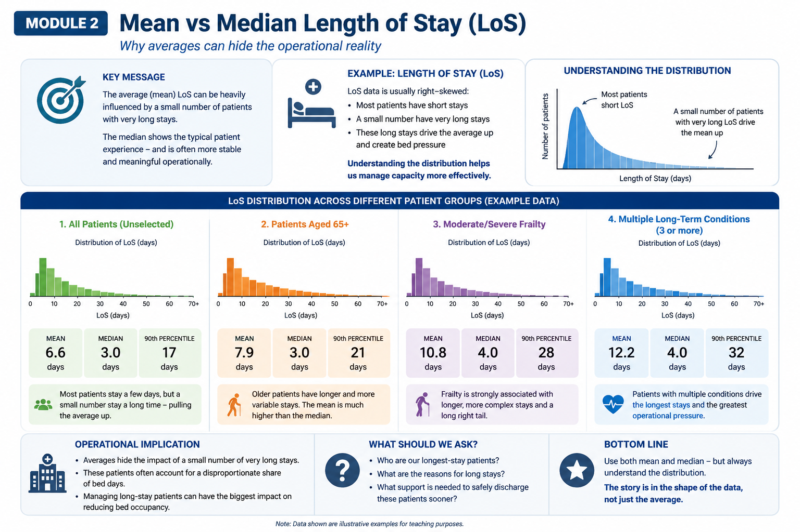

# Module 2 — Mean vs Median

# Why averages can hide operational reality

# What can an average mean?

In healthcare analytics, averages are everywhere.

We regularly see:

* average Length of Stay (LoS)
* average waiting times
* average cost per patient
* average ED attendances
* average theatre utilisation

Averages are useful because they simplify complex information into a single number that is easy to communicate and compare.

But healthcare systems are rarely “average”.

Behind a single average often sits:

* significant variation
* operational complexity
* long-tail demand
* very different patient experiences

This means averages can sometimes hide more than they reveal.

---

# Why This Matters in Healthcare

Suppose two Trusts report the following:

| Trust   | Average Length of Stay |
| ------- | ---------------------- |
| Trust A | 5.1 days               |
| Trust B | 7.2 days               |

At first glance, Trust B may appear less efficient.

But is that comparison fair?

What if Trust B:

* serves an older population
* has higher frailty prevalence
* has more patients with multiple long-term conditions
* experiences delayed discharges due to social care pressures
* operates a tertiary specialist service
* has limited community capacity

The average alone does not tell us this.

This is one of the most important principles in healthcare analytics:

> Averages summarise data — but they do not explain it.

---

# Mean vs Median

Two commonly used “averages” are:

| Measure | What it represents                         |
| ------- | ------------------------------------------ |
| Mean    | The arithmetic average across all patients |
| Median  | The middle patient when values are ordered |

The mean is sensitive to extreme values (outliers).

The median is often more stable and better reflects the “typical” patient experience.

---

# Example — Length of Stay (LoS)

Length of Stay data is usually heavily right-skewed.

This means:

* most patients stay a relatively short time
* a small number stay much longer
* those long stays pull the mean upward

For example:

| Patient Group                 | Mean LoS  | Median LoS |
| ----------------------------- | --------- | ---------- |
| All Patients                  | 6.6 days  | 3 days     |
| Patients aged 65+             | 7.9 days  | 3 days     |
| Moderate/severe frailty       | 10.8 days | 4 days     |
| Multiple long-term conditions | 12.2 days | 4 days     |

The median patient may stay only a few days.

However, a relatively small number of long-stay patients can account for a disproportionate number of occupied bed days.

Operationally, this matters enormously.

---

# Why The Distribution Matters

If we only report the mean:

* we lose visibility of variation
* we may miss operational bottlenecks
* we may misunderstand where pressure originates

Understanding the full distribution helps answer more meaningful operational questions:

* Who are our longest-stay patients?
* Why are stays prolonged?
* Which patients drive bed occupancy?
* Are delays clinical, social or pathway-related?
* Where would interventions have the greatest operational impact?

Sometimes:

> the story is in the shape of the data, not just the average.

---

# Is It Fair To Compare Trusts or ICBs Using Averages?

Partly — but with caution.

Healthcare organisations serve different populations under different operational conditions.

Simple averages may not fully account for:

* age structure
* deprivation
* frailty burden
* case complexity
* rurality
* social care capacity
* community service availability

This is why fair comparison often requires:

* peer-group benchmarking
* case-mix adjustment
* pathway segmentation
* contextual interpretation

Benchmarking should support questions and learning — not simplistic league tables.

---

# What Does Model Hospital Use?

NHS England’s Model Hospital (Model Health System) uses many averages and benchmark metrics including:

* average LoS
* theatre utilisation
* productivity metrics
* operational performance indicators

However, Model Hospital also attempts to improve fairness by using:

* peer-group comparisons
* specialty-level analysis
* segmentation
* contextual benchmarking

This reflects an important reality:

> Healthcare operational benchmarking is inherently complex.

No single metric tells the whole story.

---

# Operational Implications

Averages remain useful because they:

* summarise activity quickly
* support benchmarking
* identify broad variation
* help monitor trends over time

But averages alone should rarely drive operational decisions.

Particularly in healthcare, we must understand:

* variation
* outliers
* long-tail demand
* patient complexity
* operational context

Otherwise we risk:

* drawing incorrect conclusions
* setting unrealistic targets
* overlooking hidden operational pressures

---

# Key Takeaways

* The mean and median measure different aspects of a population
* Healthcare data is often skewed rather than normally distributed
* A small number of patients can drive disproportionate operational pressure
* The median often better reflects the “typical” patient experience
* The distribution may matter more than the average itself
* Fair comparison requires context, not just metrics
* Benchmarking should start conversations, not end them

---

# Questions Decision-Makers Should Ask

When reviewing averages:

* What does this average actually represent?
* How variable is the underlying data?
* Are there important outliers?
* Are populations comparable?
* What operational factors sit behind the numbers?
* Does the distribution reveal something the average hides?
* What action is realistically possible?
