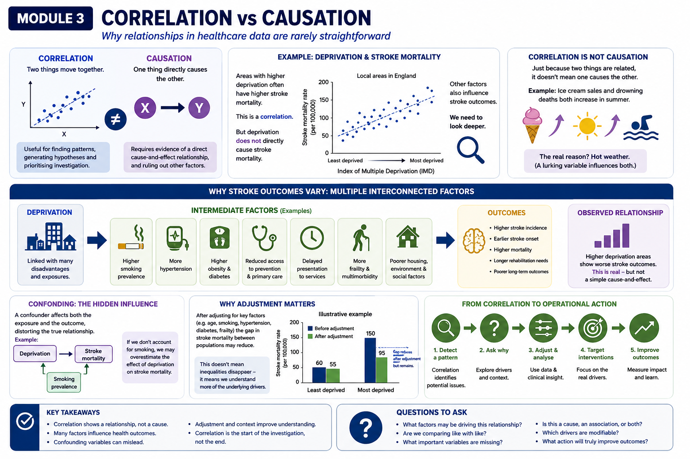

# Module 3 — Correlation vs Causation

# Why relationships in healthcare data are rarely straightforward

# When two things move together, does one cause the other?

Healthcare analytics frequently identifies relationships between variables.

For example:

* higher deprivation and worse health outcomes
* frailty and increased admissions
* obesity and diabetes
* delayed discharge and longer Length of Stay
* smoking and stroke incidence

When two variables appear related, this is known as a correlation.

However, correlation alone does not prove that one variable directly causes the other.

This distinction matters enormously in healthcare analytics because healthcare systems are complex, interconnected and influenced by many overlapping factors.

---

# What Is Correlation?

Correlation describes a relationship between two variables.

For example:

| Observation                                                              | Relationship         |
| ------------------------------------------------------------------------ | -------------------- |
| Areas with higher deprivation often have higher stroke mortality         | Positive correlation |
| Increased physical activity is associated with lower cardiovascular risk | Negative correlation |

Correlation helps us:

* identify patterns
* detect variation
* generate hypotheses
* prioritise investigation

But correlation alone cannot tell us:

* why the relationship exists
* whether the relationship is direct
* whether other factors are involved

---

# Correlation Does Not Automatically Mean Causation

Suppose we observe:

| Area                 | Stroke Mortality |
| -------------------- | ---------------- |
| Most deprived areas  | Higher           |
| Least deprived areas | Lower            |

It may be tempting to conclude:

> “Deprivation directly causes higher stroke mortality.”

However, healthcare outcomes are rarely driven by a single factor.

Deprivation may instead be linked to:

* higher smoking prevalence
* hypertension
* obesity
* diabetes
* delayed healthcare access
* poorer housing
* reduced access to prevention
* increased multimorbidity
* environmental factors

In reality, deprivation often acts as a marker for a wider set of underlying risks and system pressures.

---

# Example — Stroke Outcomes and Inequalities

Stroke outcomes often vary significantly between populations.

For example, more deprived populations may experience:

* higher stroke incidence
* earlier onset of stroke
* increased mortality
* longer rehabilitation needs
* poorer long-term outcomes

However, these differences are usually influenced by multiple interconnected factors including:

* prevalence of hypertension
* smoking rates
* access to primary care
* anticoagulation gaps in atrial fibrillation
* housing and social conditions
* delayed presentation to services
* rehabilitation access
* transport and geography

This means:

> the observed inequality is real, but the pathway causing it is complex.



---

# Confounding Variables

A confounding variable is a factor that influences both variables being studied.

For example:

Deprivation
      ↓
Smoking prevalence
      ↓
Stroke risk

If smoking prevalence is not considered, we may overestimate the direct effect of deprivation alone.

Healthcare datasets often contain many confounding variables simultaneously.

This is one reason why interpreting healthcare analytics requires caution.

---

# Why Adjustment Matters

Healthcare analytics often uses adjustment methods to improve fairness and interpretation.

Examples include:

* age standardisation
* case-mix adjustment
* regression modelling
* risk adjustment

Adjustment attempts to answer:

> “What would outcomes look like if populations were more comparable?”

For example, after adjusting for:

* age
* smoking
* hypertension
* diabetes
* frailty

…the gap in stroke mortality between populations may reduce substantially.

This does not mean inequalities disappear.

It means:

> part of the observed relationship was explained by other linked factors.

Adjustment improves understanding — it does not remove complexity.

# Looking deeper

See:

> Appendix — How Adjustment Works

---

# Correlation Can Still Be Extremely Useful

Importantly:

> correlation is not “bad”.

Correlation is often the starting point for:

* identifying inequalities
* detecting unwarranted variation
* prioritising interventions
* operational investigation
* pathway redesign

Without correlation analysis:

* many healthcare inequalities would remain hidden.

The key is understanding that:

> correlation should start questions, not end them.

---

# Operational Implications

Misinterpreting correlation as causation can lead to:

* simplistic conclusions
* ineffective interventions
* unrealistic targets
* inappropriate benchmarking

For example:

If analysis shows:

* higher ED attendance in deprived areas

…the operational response should not simply be:

> “reduce ED demand.”

Instead, systems may need to examine:

* primary care access
* prevention services
* frailty support
* transport barriers
* community capacity
* housing instability
* proactive care pathways

This moves analytics from:

* descriptive reporting
  towards:
* operational understanding and intervention.

---

# From Correlation to Operational Action

Effective healthcare analytics often follows this progression:

Correlation
    ↓
Identify underlying drivers
    ↓
Adjustment and contextual analysis
    ↓
Cohort segmentation
    ↓
Operational targeting
    ↓
Pathway redesign
```

This is where analytics becomes most valuable.

---

# Why Healthcare Data Is Particularly Complex

Healthcare systems involve:

* biological factors
* behavioural factors
* social determinants
* operational constraints
* service variation
* workforce pressures
* policy decisions

As a result:

* relationships are rarely linear
* multiple factors interact simultaneously
* causation is often difficult to isolate fully

This is why healthcare analytics requires:

* interpretation
* context
* operational understanding
  —not just statistical outputs.

---

# Key Takeaways

* Correlation describes relationships between variables
* Correlation alone does not prove causation
* Healthcare inequalities are usually driven by multiple interacting factors
* Confounding variables can distort interpretation
* Adjustment helps improve fairness and understanding
* Correlation remains extremely valuable for identifying patterns and prioritising investigation
* Healthcare analytics should support better questions, not simplistic conclusions

---

# Questions Decision-Makers Should Ask

When reviewing correlated healthcare metrics:

* What factors may sit behind this relationship?
* Are important confounding variables being missed?
* Does this represent causation, association, or both?
* Are populations truly comparable?
* What operational factors influence these outcomes?
* Which drivers are actually modifiable?
* What intervention opportunities exist?
* What additional analysis is needed before acting?

---

# Appendix — How Adjustment Works

# Why do we adjust healthcare data?

Healthcare populations are rarely directly comparable.

Two areas may differ significantly in:

* age structure
* smoking prevalence
* frailty burden
* diabetes prevalence
* hypertension prevalence
* deprivation
* access to healthcare

Adjustment attempts to account for these differences so comparisons become fairer and more meaningful.

---

# Age Adjustment

## Age-specific rate

An age-specific rate is calculated separately for each age group:

\text{Age-specific rate} = \frac{\text{Stroke deaths in age group}}{\text{Population in age group}} \times 100,000

Example:

\frac{120}{50,000} \times 100,000 = 240 \text{ per 100,000}

This allows comparison within similar age groups.

---

# Direct age-standardised rate

Age-standardisation applies a standard population structure to both populations:

\text{Age-standardised rate} = \frac{\sum(\text{age-specific rate} \times \text{standard population})}{\sum(\text{standard population})}

This answers:

> “What would the outcome rate look like if both populations had the same age structure?”

---

# Adjustment Using Regression Models

Healthcare analytics often adjusts for multiple factors simultaneously using regression models.

For example:

* age
* smoking
* hypertension
* diabetes
* frailty

may all influence stroke outcomes simultaneously.

---

# Smoking Adjustment

Smoking may be represented as:

Smoker = 1
Non-smoker = 0
```

Example model:

\text{Stroke mortality} = \beta_0 + \beta_1(\text{deprivation}) + \beta_2(\text{smoking})

This estimates whether deprivation remains associated with stroke mortality after accounting for smoking prevalence.

---

# Hypertension Adjustment

Hypertension can be added as another variable:

\log\left(\frac{p}{1-p}\right)=\beta_0+\beta_1(\text{deprivation})+\beta_2(\text{age})+\beta_3(\text{smoking})+\beta_4(\text{hypertension})

where:

* (p) represents the probability of the outcome
* the model estimates how strongly each factor is associated with the outcome while holding the others constant

---

# Diabetes Adjustment

Diabetes may also be included:

\log\left(\frac{p}{1-p}\right)=\beta_0+\beta_1(\text{deprivation})+\beta_2(\text{age})+\beta_3(\text{smoking})+\beta_4(\text{hypertension})+\beta_5(\text{diabetes})

This helps distinguish:

* the relationship between deprivation and stroke outcomes
  from
* the influence of diabetes prevalence.

---

# Frailty Adjustment

Frailty can be represented in several ways:

* frailty score
* mild/moderate/severe frailty categories
* electronic frailty index (EFI)

Example model:

\log\left(\frac{p}{1-p}\right)=\beta_0+\beta_1(\text{deprivation})+\beta_2(\text{age})+\beta_3(\text{smoking})+\beta_4(\text{hypertension})+\beta_5(\text{diabetes})+\beta_6(\text{frailty})

This estimates whether deprivation still appears associated with stroke mortality after accounting for these additional risk factors.

---


# Important Interpretation Point

Adjustment does not “remove” inequalities.

Instead, it helps us understand:

* which factors may explain part of the observed difference
* which inequalities remain after accounting for measurable risk factors

For example:

Before adjustment:

> Stroke mortality may appear substantially higher in deprived populations.

After adjustment:

> Some of the gap may reduce because smoking, hypertension, diabetes and frailty explain part of the difference.

However:

> a remaining gap may still exist due to wider social, behavioural and healthcare inequalities.

---

# Bottom Line

Adjustment improves fairness and interpretation.

But healthcare systems remain complex.

Even sophisticated adjustment models cannot fully capture:

* social context
* behavioural factors
* housing
* service access
* operational pressures
* community support capacity

This is why:

> healthcare analytics should support thoughtful interpretation, not simplistic conclusions.

