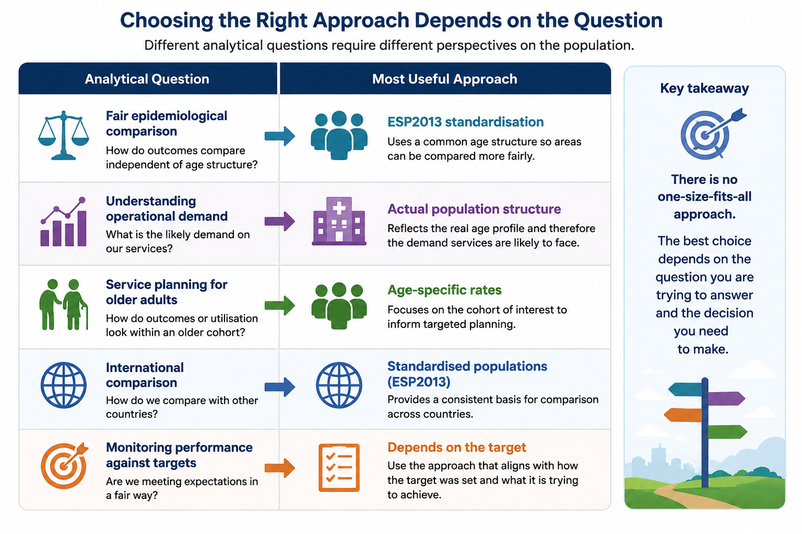

# Why do healthcare comparisons become complicated?

Healthcare organisations often compare:
- admission rates
- mortality
- ED attendance
- stroke outcomes
- Length of Stay

But populations are rarely directly comparable.

 - Some areas are older.
 - Some experience greater deprivation.
 - Some have higher frailty or multimorbidity.

This creates an important challenge:

How can we compare healthcare outcomes fairly without losing sight of operational reality?

# Why do we adjust healthcare data?

Adjustment attempts to account for these differences so comparisons become fairer and more meaningful.

---

# Age Adjustment

## Age-specific rate

An age-specific rate is calculated separately for each age group:

$$
\text{Age-specific rate} =
\frac{\text{Stroke deaths in age group}}
{\text{Population in age group}}
\times 100,000
$$

Example calculation:

$$
\frac{120}{50,000} \times 100,000
=
240 \text{ per 100,000}
$$

This allows comparison within similar age groups.

---

## Direct age-standardised rate

Age-standardisation applies a standard population structure to both populations:

 $$
\text{Age-standardised rate}
=
\frac{
\sum(\text{age-specific rate} \times \text{standard population})
}{
\sum(\text{standard population})
}
$$

This answers:

> “What would the outcome rate look like if both populations had the same age structure?”

# Which Standard Population Should We Use?

Age-standardisation requires the use of a standard population structure.

In England, the most commonly used standard population is the:

## European Standard Population (ESP2013)

This provides a consistent age distribution that allows fairer comparison between populations with different age structures.

However, the choice of standard population matters.

European Standard Population (ESP2013)

The ESP2013 is widely used because it:

* supports consistency across analyses
* enables comparison between regions and countries
* removes some of the influence of differing age structures

This is particularly useful for:

* mortality comparisons
* public health analysis
* disease incidence rates
* long-term trend analysis

> Important Limitation

The ESP2013 is an artificial reference population.

It does not necessarily reflect:

* the actual age structure of England
* local ICB populations
* operational healthcare demand

> Statistical comparability does not always equal operational comparability.

Example — Older Populations

Suppose:

- ICB A has a substantially older population
- ICB B has a younger working-age population

After age-standardisation:

their rates may appear more similar

However:

ICB A may still experience significantly greater operational pressure due to:
 * frailty
 * multimorbidity
 * discharge complexity
 * higher service utilisation

This highlights an important distinction > Statistical comparability does not always equal operational comparability.

# When National Population Structures May Be Useful

In some operational analyses, using:

national population distributions
OR
age-specific rates

may provide a more realistic reflection of expected healthcare demand.

This can be particularly relevant when analysing:

 - specific age cohorts
 - service planning
 - operational capacity
 - demand forecasting

For example:

 - ED attendance rates for people aged 75+
 - frailty prevalence
 - community service utilisation

In these situations:

 - age-specific operational demand may matter more than fully standardised comparison.

# Operational Interpretation Matters

Neither approach is universally “correct”.

The appropriate approach depends on the question being asked. For example:

# Adjustment Using Regression Models

Standardisation is one approach to improving fairness in comparison.

Healthcare analytics may also use statistical models to adjust simultaneously for multiple interacting factors.

For example:

* age
* smoking
* hypertension
* diabetes
* frailty

may all influence stroke outcomes simultaneously.

---

# Frailty Adjustment

Frailty can be represented in several ways:

* frailty score
* mild/moderate/severe frailty categories
* electronic frailty index (EFI)

Example model:

$$
\log\left(\frac{p}{1-p}\right)
=
\beta_0
+
\beta_1(\text{deprivation})
+
\beta_2(\text{age})
+
\beta_3(\text{smoking})
+
\beta_4(\text{hypertension})
+
\beta_5(\text{diabetes})
+
\beta_6(\text{frailty})
$$

This estimates whether deprivation still appears associated with stroke mortality after accounting for these additional risk factors.

# Important Interpretation Point

Adjustment does not “remove” inequalities.

Instead, it helps us understand:

* which factors may explain part of the observed difference
* which inequalities remain after accounting for measurable risk factors

For example:

Before adjustment:

> Stroke mortality may appear substantially higher in deprived populations.

After adjustment:

> Some of the gap may reduce because smoking, hypertension, diabetes and frailty explain part of the difference.

However:

> a remaining gap may still exist due to wider social, behavioural and healthcare inequalities.

---

# Key Takeaways

Adjustment improves fairness and interpretation.

But healthcare systems remain complex.

Even sophisticated adjustment models cannot fully capture:

* social context
* behavioural factors
* housing
* service access
* operational pressures
* community support capacity

This is why:

> healthcare analytics should support thoughtful interpretation, not simplistic conclusions.

# Key question: Have we genuinely made a fair comparison between populations — or have we just used statistical techniques to make the numbers look more comparable on paper?”

For example:

Two ICBs may end up with similar age-standardised ED attendance rates after adjustment.

But one ICB may still:

* have far more older people
* experience greater frailty
* face higher discharge complexity
* carry much greater operational pressure day-to-day

So statistically, the comparison may now be “fairer”.

But operationally:

the lived reality for services may still be very different.

That’s the key tension.

# Questions Decision-Makers Should Ask

When reviewing standardised or adjusted healthcare metrics:

* Could standardisation be masking genuine operational pressure?
* Are we interpreting statistical fairness as operational fairness?
* What action would realistically follow from this comparison?
* Are the populations actually comparable?
* Would crude rates give a misleading impression?
* How different are the underlying age structures?
* What factors have been adjusted for — and what has not been adjusted for?
* Does the adjustment method fit the operational question being asked?
* Are we trying to understand epidemiological risk, operational demand, or both?
* Are differences driven by population need, pathway maturity, service access, or performance?
* Does a “better” standardised rate necessarily mean lower operational burden?
* Are age-standardised rates appropriate for this specific cohort or pathway?
* Should we also examine age-specific rates alongside standardised rates?
* Would peer-group comparison be fairer than national comparison?
* Are targets equally realistic across systems with different population profiles?
* Are we comparing healthcare systems with similar levels of deprivation, frailty and multimorbidity?
* What important contextual information may still be missing after adjustment?
* Could the metric still be hiding inequalities within subgroups?

