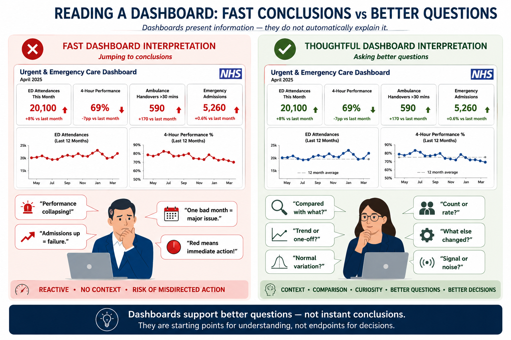

## Module 6 — How to Read a Dashboard

### *What is the dashboard really telling us — and what might we misunderstand?*

## Module Learning Objective

This module helps explain:

> how healthcare dashboards should be interpreted critically — and why dashboards are often starting points for questions rather than endpoints for conclusions.

By the end of this module, readers should feel more confident asking:

> *What is this dashboard really telling us — and what might I be misunderstanding?*

The module focuses on practical healthcare dashboards commonly used to monitor:

* Emergency Department (ED) activity
* emergency admissions
* elective recovery
* ambulance handover delays
* delayed discharge
* pathway performance
* population health and inequalities
* operational flow

Rather than teaching how dashboards are built, this module focuses on:

> **how dashboards should be interpreted**

to support better questions and better decision-making.

---

# Why Dashboards Matter

Healthcare systems increasingly rely on dashboards.

Every day, leaders across healthcare review information intended to support decisions about:

* demand
* operational performance
* quality
* access
* inequalities
* workforce pressure
* system improvement

Examples may include:

* Emergency Department performance dashboards
* elective waiting list dashboards
* ambulance handover dashboards
* discharge and flow dashboards
* population health dashboards
* inequalities dashboards
* pathway monitoring dashboards

Dashboards are powerful because they help simplify large volumes of information.

Instead of reading lengthy reports:

decision-makers can quickly see:

```text
performance trends
variation
comparison
risk
areas requiring attention
```

However:

> **dashboards do not speak for themselves**

A dashboard presents information.

It does not automatically explain:

> why something happened

or

> what should happen next

This distinction matters.

Because poor dashboard interpretation can lead to:

* overreaction to normal variation
* misleading conclusions
* poor investment decisions
* misplaced operational attention
* false reassurance

Good dashboard interpretation therefore asks:

> *What am I really looking at?*

before asking:

> *What should we do?*

---

## A Practical Healthcare Example

Imagine an executive team reviewing a monthly urgent and emergency care dashboard.

The dashboard shows:

| Measure                   | Last Month | This Month |
| ------------------------- | ---------: | ---------: |
| ED attendances            |     18,400 |     20,100 |
| 4-hour performance        |        76% |        69% |
| Ambulance handover delays |        420 |        590 |
| Emergency admissions      |      5,230 |      5,260 |

At first glance:

this looks concerning.

A quick conclusion might be:

> *Urgent care performance is deteriorating.*

But an important question remains:

> **What is actually driving this change?**

Before acting, a decision-maker might reasonably ask:

* Is this seasonal?
* Is this normal variation?
* Are attendances increasing because of respiratory illness?
* Is performance deteriorating everywhere nationally?
* Is there a meaningful trend — or a single-month fluctuation?
* Are the metrics connected?

This illustrates an important idea:

> **dashboards rarely provide answers on their own**

Instead:

> **they help us ask better questions**

---

# Common Dashboard Interpretation Mistakes

One of the biggest risks in healthcare analytics is assuming dashboards are self-explanatory.

In practice:

well-intentioned decision-makers often draw conclusions too quickly.

The goal is not to criticise dashboards.

Instead:

> **to avoid drawing the wrong conclusion too quickly**

---

## Mistake 1 — Focusing Only on Red, Amber and Green Status

Many dashboards use:

```text
🔴 Red
🟠 Amber
🟢 Green
```

to summarise performance.

This can be useful.

But it can also oversimplify reality.

For example:

A metric may appear:

```text
🔴 RED
```

because a target was narrowly missed.

Meanwhile:

performance may actually be improving.

Similarly:

something shown as:

```text
🟢 GREEN
```

may still hide important problems.

For example:

performance may technically exceed threshold —

but still be deteriorating over time.

A useful question becomes:

> *Compared with what?*

For example:

* previous performance?
* peer organisations?
* national trend?
* expected seasonal variation?

Good dashboard interpretation asks:

> **What sits behind the colour?**

rather than simply:

> *Is it red or green?*

---

## Mistake 2 — Confusing Counts with Rates

This links directly back to:

> **Module 1 — Counts vs Rates**

A dashboard may show:

```text
Higher emergency admissions
```

But this does not automatically mean:

> worse performance.

Why?

Because larger populations naturally generate larger numbers.

For example:

an Integrated Care Board serving:

```text
1 million people
```

would reasonably be expected to have:

> more admissions

than one serving:

```text
350,000 people
```

Similarly:

areas with older populations may naturally experience:

> higher healthcare utilisation.

This means dashboard interpretation should ask:

> *Am I looking at counts or rates?*

and:

> *Is this comparison fair?*

For example:

* crude counts?
* rates per population?
* age-standardised comparison?
* deprivation-adjusted comparison?

Without context:

dashboards can unintentionally mislead.

---

## Mistake 3 — Overreacting to Single-Month Changes

Healthcare systems naturally fluctuate.

This links directly back to:

> **Module 4 — Variation & Distributions**

For example:

imagine:

```text
ED attendances ↑ 8%
```

in one month.

Question:

> *Does this represent a meaningful change?*

Maybe.

But maybe not.

Healthcare systems are noisy.

Variation happens because of:

* seasonal illness
* bank holidays
* staff shortages
* coding differences
* operational disruption
* random fluctuation

A single month of deterioration does not necessarily mean:

> performance is collapsing.

Similarly:

a single month of improvement does not necessarily mean:

> a scheme worked.

This is why dashboards often benefit from:

> **trends**

rather than isolated points.

Or:

> **Statistical Process Control (SPC)**

which helps distinguish:

```text
normal variation
```

from

```text
meaningful change
```

A useful question becomes:

> *Are we observing signal — or noise?*

The image below illustrates an important distinction between:

> **reacting to dashboards**

and

> **interpreting dashboards critically**

Fast dashboard interpretation can sometimes lead to conclusions based on colours, isolated metrics or single-month changes.

More thoughtful interpretation instead asks:

> **What context, comparison or explanation might sit behind the numbers?**



Good dashboard interpretation focuses less on immediate conclusions and more on:

> **context, comparison, variation and better questions**

Dashboards help surface patterns and areas requiring attention.

However:

> interpretation still requires context, judgement and questioning

Before moving on, consider:

> *Am I reacting to the dashboard — or interpreting it?*

---

## Mistake 4 — Ignoring Denominators

Another common mistake is focusing only on raw numbers.

A dashboard may show:

> **50 emergency admissions from care homes**

Question:

> *Is this high or low?*

The answer depends on:

- how many care home residents exist
- the size of the older population
- expected baseline utilisation
- comparison with peers


```markdown
Similarly:

> **40 inpatient falls**

might initially feel alarming.

But interpretation changes dramatically if this occurred across:

> **500 admissions**

versus:

> **25,000 occupied bed days**

This matters for:

* admissions
* complaints
* mortality
* harm incidents
* screening uptake
* readmissions
* pathway conversion

Raw numbers alone rarely tell the full story.

Good dashboard interpretation therefore asks:

> *Relative to what?*

---

## Mistake 5 — Assuming Correlation Means Causation

This links back to:

> **Module 3 — Correlation vs Causation**

Dashboards frequently show things moving together.

For example:

```text
ED attendance ↑
4-hour performance ↓
```

Question:

> *Did one cause the other?*

Maybe.

But dashboards alone rarely prove causation.

Other factors may contribute:

* staffing
* flow delays
* bed occupancy
* discharge delays
* seasonal illness

A dashboard may show:

> **association**

without proving:

> **cause**

Good interpretation asks:

> *What else might explain this pattern?*

---

## Reflection

Before moving on, ask:

> *If a dashboard suddenly looked concerning, what questions would I want answered before acting?*

Good dashboard interpretation begins with curiosity rather than immediate conclusions.

---
## Part 2 — What Questions Should Decision-Makers Ask?
---
