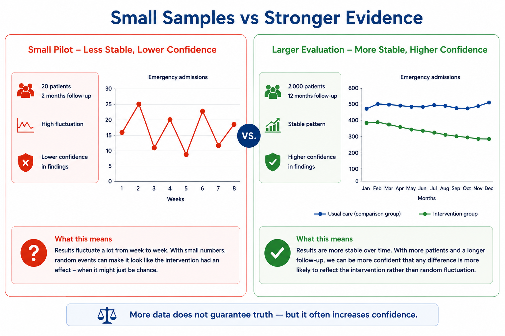
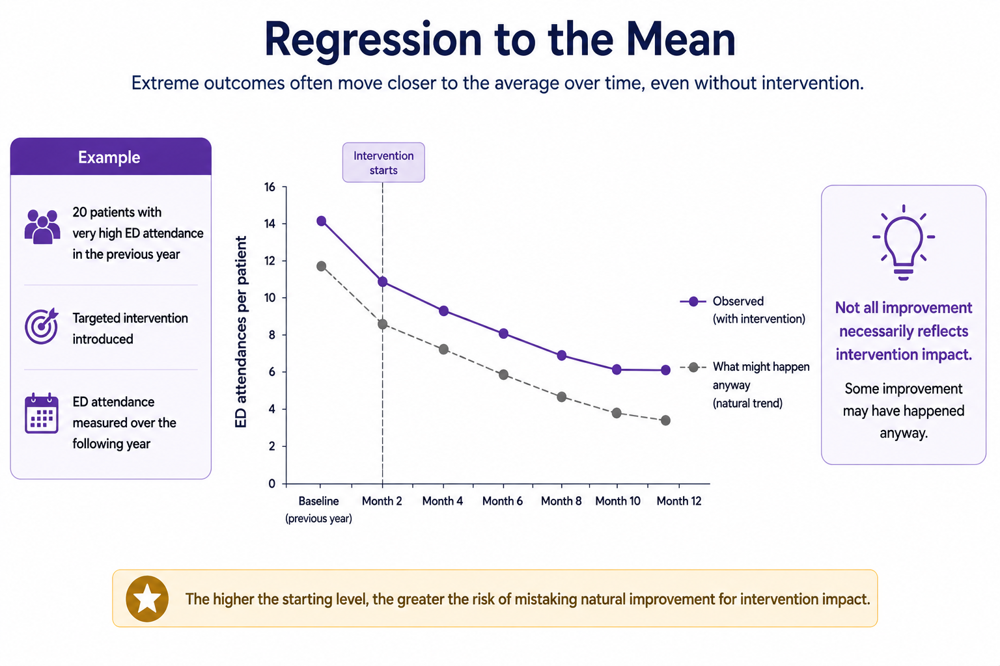

# Module 7 — Evaluating Interventions in Practice - Methods

### *How healthcare systems improve confidence in evaluation findings*

## Module Learning Objective

This module helps explain:

> how healthcare systems move beyond simple before-and-after comparisons by using more robust approaches to improve confidence that an intervention genuinely contributed to observed change.

By the end of this module, readers should feel more confident asking:

> *How strong is the evidence that this intervention worked?*

The module focuses on practical healthcare examples, particularly interventions intended to reduce:

* Emergency Department (ED) attendances
* emergency admissions
* avoidable hospital utilisation
* delayed discharge
* operational pressure

Rather than assuming healthcare systems can ever prove impact with complete certainty, the module focuses on:

> **improving confidence in evaluation findings**

through more thoughtful and structured approaches.

# From Module 6 to Module 7

In Module 6, we introduced an important idea:

> **improvement alone does not prove impact**

Healthcare systems frequently observe change after an intervention.

For example:

```text
ED attendances ↓
Emergency admissions ↓
```

But an important question remains:

> *Would this improvement have happened anyway?*

This idea introduced:

* counterfactual thinking
* confidence in evidence
* contribution versus attribution
* the limitations of simple before-and-after comparisons

The question now becomes:

> **How do healthcare systems improve confidence that an intervention genuinely contributed to observed change?**

This module introduces practical approaches that are commonly used in healthcare evaluation.

These approaches do not eliminate uncertainty.

Instead, they help decision-makers ask:

> *How confident should we be?*

# Why Practical Evaluation Methods Matter

Healthcare systems often need to make decisions quickly.

Programmes are launched:

* under operational pressure
* during winter demand
* amidst workforce shortages
* alongside other service changes

Decision-makers may need to decide:

* whether to continue funding a scheme
* whether to scale it across the system
* whether to redesign or stop it

Yet waiting for perfect evidence is rarely realistic.

This creates an important challenge:

> **How do we improve confidence in evaluation findings without waiting years for certainty?**

Practical evaluation methods help by:

* improving comparisons
* strengthening counterfactual thinking
* reducing misleading conclusions
* increasing confidence in observed impact

Importantly:

> stronger methods do not guarantee truth.

Instead:

> they help reduce the risk of reaching the wrong conclusion.

# Randomised Controlled Trials (RCTs)

One of the strongest ways to evaluate whether an intervention caused change is through a:

> **Randomised Controlled Trial (RCT)**

RCTs are often described as the:

> **gold standard of evaluation**

because they help create a stronger counterfactual.

## What Is an RCT?

In simple terms:

an RCT compares two groups.

One group receives:

> **the intervention**

The other receives:

> **usual care (or no intervention)**

Participants are assigned randomly.

This is important because randomisation helps reduce bias.

In theory:

> the two groups should be broadly similar at the start.

If outcomes later differ:

we can have greater confidence that:

> **the intervention contributed to the change**

rather than:

* chance
* selection bias
* population differences
* other confounding factors

## A Practical Healthcare Example

Imagine an Integrated Care Board introduces a frailty intervention designed to reduce emergency admissions.

Rather than implementing the service everywhere immediately:

several Primary Care Networks (PCNs) are selected to participate.

Patients are randomly allocated.

### Group A

Receives:

* proactive frailty review
* medication optimisation
* MDT support
* community monitoring

### Group B

Receives:

> usual care

After twelve months:

| Measure              | Intervention Group | Usual Care |
| -------------------- | -----------------: | ---------: |
| ED attendances       |                900 |      1,100 |
| Emergency admissions |                320 |        420 |

Question:

> *Did the intervention contribute to improvement?*

Because patients were randomly allocated, we can generally have:

> **greater confidence that observed differences are more likely to reflect the intervention rather than underlying differences between patients.**

## Why Randomisation Matters

Without randomisation:

services may unintentionally select patients who are:

- easier to help
- more engaged
- less clinically complex
- more motivated

This creates a problem known as:

> **selection bias**

For example:

a frailty service might prioritise patients who are already likely to improve.

The intervention may then appear more successful than it truly is.

Randomisation helps reduce this risk.


The key idea is simple:

RCTs attempt to improve fairness in comparison by reducing differences between groups before outcomes are compared.

> **random allocation improves confidence that differences in outcomes are more likely to reflect the intervention rather than underlying differences between patients.**

## Why RCTs Are Difficult in Real Healthcare Systems

Despite their strengths:

RCTs are often difficult to implement in real healthcare systems.

RCTs can provide strong evidence.

However:

> **strong evidence is not always operationally practical evidence**

Healthcare environments are messy.

Operational realities include:

* workforce shortages
* service redesign during implementation
* changing pathways
* political and operational pressure to scale interventions quickly
* ethical concerns about withholding care

For example:

if early evidence suggests a service is beneficial:

leaders may feel uncomfortable withholding support from some patients.

Similarly:

healthcare systems often need to move quickly.

Waiting several years for a perfect evaluation may not feel realistic when:

* Emergency Departments are under pressure
* emergency admissions are rising
* operational performance is deteriorating

As a result:

many healthcare evaluations rely on:

> **pragmatic approaches**

that improve confidence without requiring a full RCT.

## Key Message

RCTs are powerful because they help create stronger comparisons between intervention and non-intervention groups.

However:

> **strong evidence is not always operationally practical evidence**

Healthcare systems often need approaches that balance:

> **rigour**

with

> **operational reality**

## Part 1 Reflection

Before moving on, ask:

> *If a scheme appears successful, how confident are we that the groups being compared were genuinely comparable?*

In the next section, we explore another important question:

> *How much evidence is enough to trust the findings?*

This introduces:

> **sample size and statistical power**

## Sample Size, Statistical Power and Confidence in Findings

In Module 6, we introduced an important question:

> *How confident are we that an intervention genuinely contributed to observed change?*

Even when groups are fairly compared, another important challenge remains:

> **Do we have enough evidence to trust what we are seeing?**

This is where:

> **sample size**
> and
> **statistical power**

become important.

Fortunately, the core idea is much simpler than the terminology suggests.

# Why Small Numbers Can Mislead

Healthcare systems often evaluate schemes using:

* small pilots
* short implementation periods
* highly selected patient groups
* limited operational data

For example:

A frailty intervention is piloted for:

```text id="rz2k14"
20 patients
```

After three months:

| Measure              | Before | After |
| -------------------- | -----: | ----: |
| ED attendances       |     42 |    28 |
| Emergency admissions |     17 |    10 |

At first glance:

> the scheme appears successful.

But an important question remains:

> **How confident should we be that this change reflects genuine impact rather than normal fluctuation?**

Small numbers naturally fluctuate.

A handful of patients can disproportionately influence results.

For example:

if two highly complex patients experience:

* hospitalisation
* bereavement
* worsening frailty
* medication changes

outcomes may change substantially.

Similarly:

if several patients improve naturally:

results may look highly positive.

This means:

> **Small pilots may produce convincing-looking results that are less reliable than they first appear.**

## What Do We Mean by Sample Size?

Sample size simply refers to:

> **how many people, events or observations are included in an evaluation**

Examples include:

* number of patients enrolled in a scheme
* number of Emergency Department attendances analysed
* number of GP practices or PCNs involved
* number of months of activity included

In general:

> **larger samples tend to produce more stable and reliable findings**

because random fluctuation becomes less influential.

This does not mean:

> **larger automatically means better**

Poor evaluation design can still produce misleading conclusions.

However:

> **small numbers deserve greater caution**

## Statistical Power (In Plain English)

Statistical power sounds technical.

But the underlying question is straightforward:

> **If a real improvement exists, how likely are we to detect it?**

Low-powered evaluations may fail to detect genuine effects.

For example:

a frailty scheme may genuinely reduce emergency admissions by:

```text id="v6q2mu"
5%
```

But if:

* only a small number of patients are included
* follow-up time is short
* variation is high

the evaluation may struggle to detect the change.

Decision-makers may incorrectly conclude:

> *The intervention didn’t work*

when the evaluation simply lacked enough information.

In practice:

> **small evaluations are more likely to miss real effects — or overreact to random fluctuation.**

## A Practical Healthcare Example

Imagine two evaluations of the same frailty pathway.

### Evaluation A

```text id="h9sq2n"
20 patients
2 months follow-up
```

Observed result:

```text id="m34m0w"
Emergency admissions ↓
```

Question:

> *Was this meaningful improvement — or random fluctuation?*

Confidence remains limited.

### Evaluation B

```text id="8vj5kh"
2,000 patients
12 months follow-up
Comparator group included
```

Observed result:

```text id="ey0v1z"
Emergency admissions ↓
```

Question:

> *How confident are we now?*

Confidence is greater because:

* more patients were observed
* longer time period analysed
* natural fluctuation matters less
* comparison is stronger

This does not guarantee truth.

But it increases confidence.

The image below illustrates why small evaluations often produce more unstable and uncertain findings.



## Why This Matters for Healthcare Decision-Making

Healthcare systems often pilot schemes quickly.

Leaders may face pressure to decide:

* continue funding
* scale across the system
* redesign
* stop

before strong evidence exists.

This creates an important tension:

> **speed of learning**

versus

> **confidence in conclusions**

The question is rarely:

> *Can we be completely certain?*

Instead:

> *How confident should we be before acting?*

---

# Regression to the Mean

Even when evaluations include enough observations, another important challenge remains:

> **could improvement have happened naturally anyway?**

This brings us to:

> regression to the mean

The name sounds complicated.

The idea is not.

It describes a simple tendency:

> **extreme outcomes often become less extreme over time**

even without intervention.

This matters enormously in healthcare.

Because interventions are often targeted at:

* high-risk patients
* high-intensity users
* people with repeated admissions
* people with severe frailty

In other words:

> **the very people already experiencing unusually extreme outcomes**

---

## A Practical Healthcare Example

Imagine a healthcare system identifies:

```text id="mvv65s"
20 patients
```

with very high Emergency Department attendance.

Each attended:

```text id="fhvpg2"
10–15 times
```

during the previous year.

A targeted intervention is introduced.

For example:

* care coordination
* frailty MDT support
* proactive monitoring
* social prescribing
* medication review

One year later:

ED attendance falls.

Question:

> *Did the intervention work?*

Maybe.

But another possibility exists.

Patients selected because they experienced unusually extreme healthcare utilisation may naturally move closer to average levels over time.

Some people improve naturally because:

* acute illness resolves
* social circumstances stabilise
* medication changes occur
* temporary crises pass

This means:

> **extreme patients often improve somewhat even without intervention**

---

## Why Regression to the Mean Matters

Without recognising regression to the mean:

healthcare systems may mistakenly conclude:

> *The scheme worked*

when some improvement might have happened anyway.

This is particularly important when evaluating:

* high-intensity ED attenders
* frequent emergency admissions
* severe frailty cohorts
* complex multimorbidity pathways

The higher the starting level of risk:

> **the greater the risk of mistaking natural fluctuation for intervention impact**

The image below illustrates an important evaluation risk:

> not all improvement necessarily reflects intervention impact.



## Key Message

Small pilots and extreme patient groups can easily mislead evaluation.

Healthcare systems should therefore ask:

> **Are we observing genuine intervention impact — or natural fluctuation?**

Good evaluation becomes stronger when we ask:

> *Do we have enough evidence?*

and

> *Could improvement have happened anyway?*

---

## Part 2 Reflection

Before moving on, ask:

> *If outcomes improved, are we confident this reflects intervention impact — or could small numbers and natural fluctuation explain part of the change?*

In the next section, we explore practical approaches that healthcare systems use to strengthen comparisons in real-world settings:

> **Interrupted Time Series (ITS)**
> and
> **Difference-in-Differences (DiD)**


