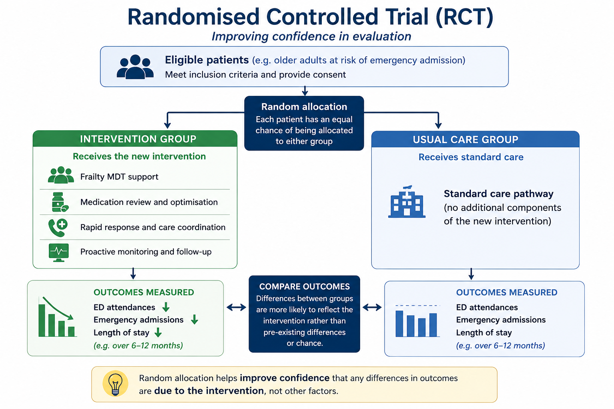

# Module 7 — Evaluating Interventions in Practice

### *How healthcare systems improve confidence in evaluation findings*

## Module Learning Objective

This module helps explain:

> how healthcare systems move beyond simple before-and-after comparisons by using more robust approaches to improve confidence that an intervention genuinely contributed to observed change.

By the end of this module, readers should feel more confident asking:

> *How strong is the evidence that this intervention worked?*

The module focuses on practical healthcare examples, particularly interventions intended to reduce:

* Emergency Department (ED) attendances
* emergency admissions
* avoidable hospital utilisation
* delayed discharge
* operational pressure

Rather than assuming healthcare systems can ever prove impact with complete certainty, the module focuses on:

> **improving confidence in evaluation findings**

through more thoughtful and structured approaches.

---

# From Module 6 to Module 7

In Module 6, we introduced an important idea:

> **improvement alone does not prove impact**

Healthcare systems frequently observe change after an intervention.

For example:

```text
ED attendances ↓
Emergency admissions ↓
```

But an important question remains:

> *Would this improvement have happened anyway?*

This idea introduced:

* counterfactual thinking
* confidence in evidence
* contribution versus attribution
* the limitations of simple before-and-after comparisons

The question now becomes:

> **How do healthcare systems improve confidence that an intervention genuinely contributed to observed change?**

This module introduces practical approaches that are commonly used in healthcare evaluation.

These approaches do not eliminate uncertainty.

Instead, they help decision-makers ask:

> *How confident should we be?*

---

# Why Practical Evaluation Methods Matter

Healthcare systems often need to make decisions quickly.

Programmes are launched:

* under operational pressure
* during winter demand
* amidst workforce shortages
* alongside other service changes

Decision-makers may need to decide:

* whether to continue funding a scheme
* whether to scale it across the system
* whether to redesign or stop it

Yet waiting for perfect evidence is rarely realistic.

This creates an important challenge:

> **How do we improve confidence in evaluation findings without waiting years for certainty?**

Practical evaluation methods help by:

* improving comparisons
* strengthening counterfactual thinking
* reducing misleading conclusions
* increasing confidence in observed impact

Importantly:

> stronger methods do not guarantee truth.

Instead:

> they help reduce the risk of reaching the wrong conclusion.

---

# Randomised Controlled Trials (RCTs)

One of the strongest ways to evaluate whether an intervention caused change is through a:

> **Randomised Controlled Trial (RCT)**

RCTs are often described as the:

> **gold standard of evaluation**

because they help create a stronger counterfactual.

---

## What Is an RCT?

In simple terms:

an RCT compares two groups.

One group receives:

> **the intervention**

The other receives:

> **usual care (or no intervention)**

Participants are assigned randomly.

This is important because randomisation helps reduce bias.

In theory:

> the two groups should be broadly similar at the start.

If outcomes later differ:

we can have greater confidence that:

> **the intervention contributed to the change**

rather than:

* chance
* selection bias
* population differences
* other confounding factors

---

## A Practical Healthcare Example

Imagine an Integrated Care Board introduces a frailty intervention designed to reduce emergency admissions.

Rather than implementing the service everywhere immediately:

several Primary Care Networks (PCNs) are selected to participate.

Patients are randomly allocated.

### Group A

Receives:

* proactive frailty review
* medication optimisation
* MDT support
* community monitoring

### Group B

Receives:

> usual care

After twelve months:

| Measure              | Intervention Group | Usual Care |
| -------------------- | -----------------: | ---------: |
| ED attendances       |                900 |      1,100 |
| Emergency admissions |                320 |        420 |

Question:

> *Did the intervention contribute to improvement?*

Because patients were randomly allocated, we can generally have:

> **greater confidence that observed differences are more likely to reflect intervention impact**

rather than underlying differences between patient groups.

## Why Randomisation Matters

Without randomisation:

services may unintentionally select patients who are:

- easier to help
- more engaged
- less clinically complex
- more motivated

This creates a problem known as:

> **selection bias**

For example:

a frailty service might prioritise patients who are already likely to improve.

The intervention may then appear more successful than it truly is.

Randomisation helps reduce this risk.



The key idea is simple:

RCTs attempt to improve fairness in comparison.

> **random allocation improves confidence that differences in outcomes are more likely to reflect the intervention rather than underlying differences between patients.**

## Why RCTs Are Difficult in Real Healthcare Systems

Despite their strengths:

RCTs are often difficult to implement in real healthcare systems.

Healthcare environments are messy.

Operational realities include:

* workforce shortages
* service redesign during implementation
* changing pathways
* political and operational pressure to scale interventions quickly
* ethical concerns about withholding care

For example:

if early evidence suggests a service is beneficial:

leaders may feel uncomfortable withholding support from some patients.

Similarly:

healthcare systems often need to move quickly.

As a result:

many healthcare evaluations rely on:

> **pragmatic approaches**

that improve confidence without requiring a full RCT.

RCTs can provide strong evidence.

However:

> strong evidence is not always operationally practical evidence.

Healthcare environments are messy.

Operational realities include:

Waiting several years for a perfect evaluation may not feel realistic when:

* Emergency Departments are under pressure
* emergency admissions are rising
* operational performance is deteriorating

## Key Message

RCTs are powerful because they help create stronger comparisons between intervention and non-intervention groups.

However:

> **strong evidence is not always operationally practical evidence**

Healthcare systems often need approaches that balance:

> **rigour**

with

> **operational reality**

## Part 1 Reflection

Before moving on, ask:

> *If a scheme appears successful, how confident are we that the patients receiving it were genuinely comparable to those who did not?*

In the next section, we explore another important question:

> *How much evidence is enough to trust the findings?*

This introduces:

> **sample size and statistical power**

