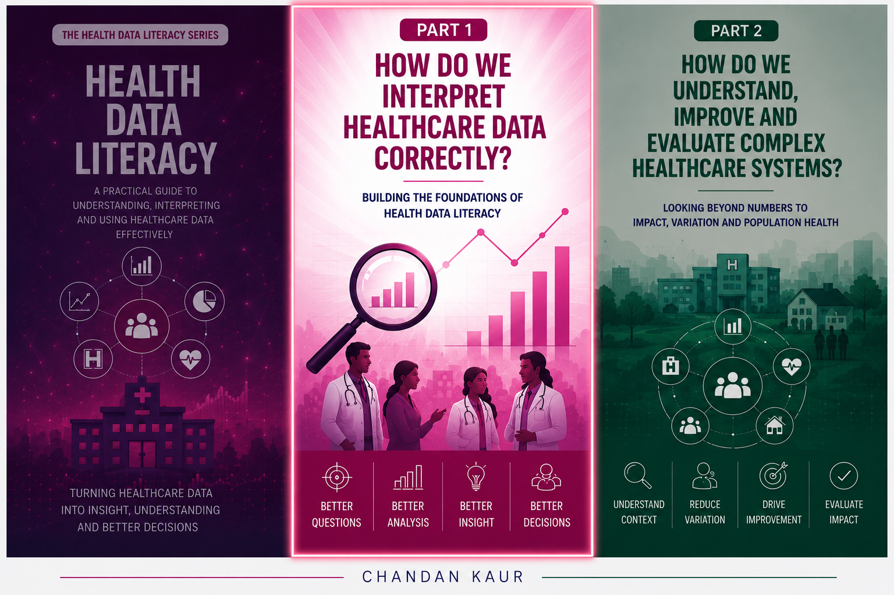
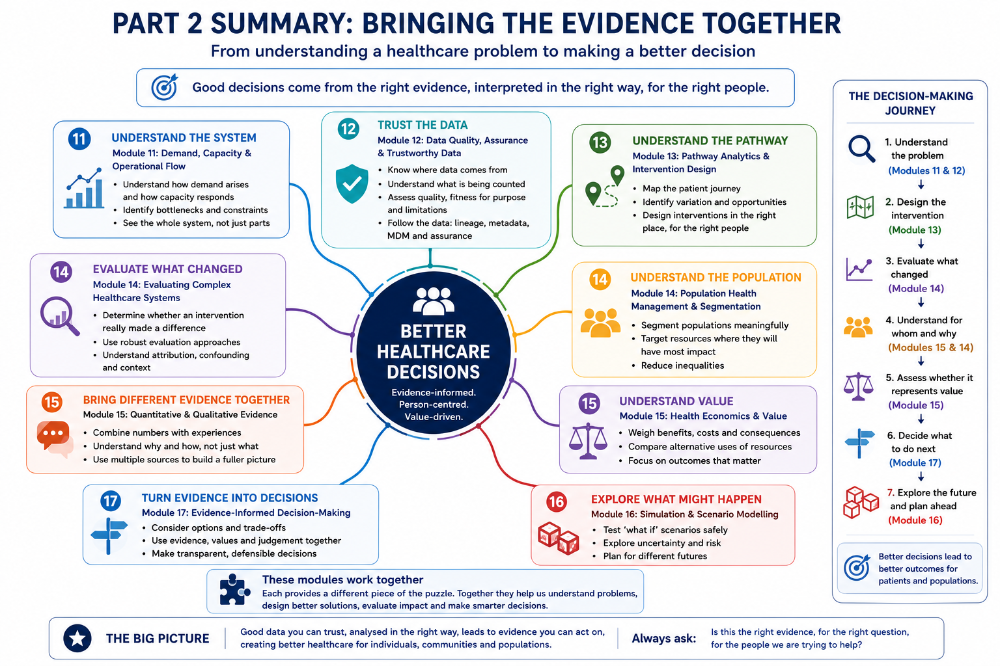

# Part 2 — How do we understand, improve and evaluate complex healthcare systems?

{fig-align="center"}

Part 2 moves beyond interpreting individual statistics and focuses on how healthcare systems behave, how interventions are designed and evaluated, and how evidence is brought together to support better decisions.

The modules in this section explore:

- demand, capacity and operational flow
- trustworthy data and assurance
- pathway analytics and intervention design
- evaluation of complex healthcare systems
- population health management and segmentation
- quantitative and qualitative evidence
- health economics and value
- evidence-informed decision-making
- simulation and scenario modelling

---

# Bringing Part 2 Together

The modules in Part 2 are not standalone topics.

Together, they provide a way of moving from **understanding a healthcare problem** to **making a better-informed decision**.

::: {.callout-important}
## The Big Picture

Good healthcare decisions rarely come from a single dataset, metric or analytical method.

They require us to:

**understand the system**

↓

**trust the data**

↓

**understand the pathway and population**

↓

**evaluate what changed**

↓

**combine different forms of evidence**

↓

**consider value and trade-offs**

↓

**make an evidence-informed decision**

↓

**explore what might happen next**

Each module contributes a different piece of that decision-making journey.
:::
