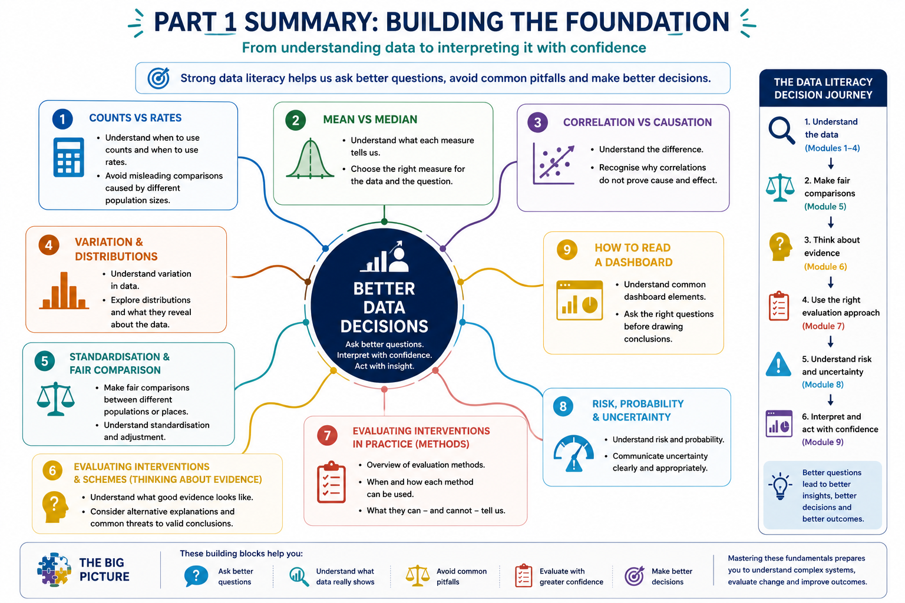

# Part 1 — How do we interpret healthcare data correctly?

Part 1 builds the foundations of health data literacy.

Before we can evaluate complex interventions, understand healthcare systems or use advanced analytical methods, we first need to be confident in how we **interpret the data in front of us**.

The modules in this section explore:

- when to use counts and rates
- the difference between means and medians
- why correlation does not necessarily mean causation
- how to understand variation and distributions
- how to make fair comparisons between different populations
- how to think critically about evidence and evaluation
- how different evaluation methods can help us understand impact
- how to interpret risk, probability and uncertainty
- how to read dashboards more critically

Together, these concepts provide the foundations for asking better questions of healthcare data.

# Bringing Part 1 Together

The modules in Part 1 are not simply a collection of statistical concepts.

Together, they help build a way of **thinking about data**.

The aim is not for every healthcare decision-maker to become a statistician or analyst.

It is to develop enough data literacy to:

- ask better questions
- recognise when a number may be misleading
- understand what the data can — and cannot — tell us
- challenge comparisons that may not be fair
- recognise uncertainty
- distinguish association from causation
- understand the strength of the evidence
- make more informed decisions

{fig-align="center"}

::: {.callout-important}
## The Big Picture

Good data literacy starts with asking the right questions.

When looking at healthcare data, we need to understand:

**What exactly are we measuring?**

↓

**Are we using the right measure?**

↓

**What does the distribution and variation tell us?**

↓

**Are we making a fair comparison?**

↓

**Could there be another explanation for what we are seeing?**

↓

**How strong is the evidence?**

↓

**How certain are we about the conclusion?**

↓

**What should we reasonably conclude and act upon?**

These questions help us move from simply **seeing numbers** to **interpreting evidence with confidence**.
:::

# From Data Literacy to Understanding Healthcare Systems

Part 1 provides the foundations, but healthcare decisions rarely depend on interpreting a single number or metric in isolation.

Healthcare operates as a complex system.

Demand changes. Patients move through pathways. Capacity is constrained. Populations have different needs. Multiple interventions may be introduced at the same time. Data may be incomplete. Resources are finite.

This means that good data literacy must eventually move beyond asking:

> **"What does this number mean?"**

towards asking:

> **"What is happening across the wider system — and what should we do about it?"**

That is the focus of **Part 2**.

Part 2 builds on these foundations to explore how we can better **understand, improve and evaluate complex healthcare systems**.
