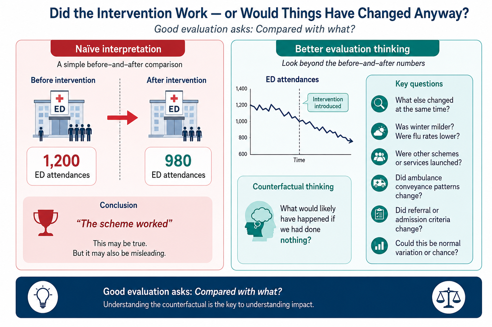
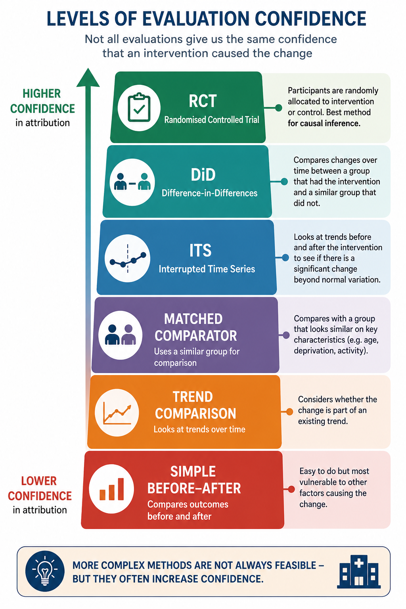

## Module 7 — Thinking About Evidence & Evaluation

### *Did it work — or would things have changed anyway?*

## Module Learning Objective

This module helps explain:

> why evaluating healthcare interventions is often more difficult than it first appears — and how decision-makers can think more critically about whether changes in outcomes are genuinely attributable to a scheme or intervention.

By the end of this module, readers should feel more confident asking:

> *Did this intervention actually work — or would things have changed anyway?*

The module focuses on practical healthcare examples, particularly interventions intended to reduce:

* Emergency Department (ED) attendances
* emergency admissions
* avoidable hospital utilisation
* delayed discharge
* operational pressure

It introduces practical approaches to evaluation without assuming prior statistical knowledge.

# Why Evaluating Healthcare Interventions Matters

Healthcare systems frequently introduce schemes designed to improve outcomes or reduce demand.

Examples may include:

* frailty pathways
* virtual wards
* Same Day Emergency Care (SDEC) services
* care navigation models
* community multidisciplinary teams (MDTs)
* anticipatory care programmes
* admission avoidance services
* discharge coordination schemes

These interventions are often introduced with positive intentions:

> reduce Emergency Department attendance

> avoid unnecessary admissions

> improve patient outcomes

> reduce pressure on services

After implementation, a common question quickly emerges:

> **Did it work?**

It sounds like a simple question.

Yet in healthcare, it is often one of the hardest questions to answer.

::: {.callout-important}
## A Key Principle

Healthcare systems frequently struggle to distinguish between **genuine intervention effects** and changes that may have happened anyway.

Observed improvement does **not** automatically mean that an intervention caused the improvement.
:::

This is because healthcare systems rarely remain static.

At the same time as an intervention is introduced:

* winter pressures may occur
* staffing may change
* patient need may shift
* flu or respiratory illness may rise or fall
* other schemes may begin
* pathways may change
* coding practices may evolve

This means:

> Improvement does not automatically imply impact — and observed change does not automatically mean the intervention caused it.

A reduction in Emergency Department attendance does not necessarily mean:

> *the intervention caused the reduction.*

## A Practical Healthcare Example

Imagine an Integrated Care Board introduces a new frailty service intended to reduce Emergency Department attendance among older adults.

The service provides:

* proactive frailty assessment
* community MDT support
* medication review
* rapid response care coordination

After six months:

| Measure              | Before Scheme | After Scheme |
| -------------------- | ------------: | -----------: |
| ED attendances       |         1,200 |          980 |
| Emergency admissions |           450 |          390 |

At first glance:

> The scheme appears successful.

ED attendance has fallen.

Emergency admissions have also fallen.

But an important question remains:

> **Would this reduction have happened anyway?**

This question sits at the heart of intervention evaluation.

# The Biggest Evaluation Mistake: Before-and-After Comparisons

One of the most common mistakes in healthcare evaluation is relying solely on simple before-and-after comparisons.

For example:

```text
Before intervention:
1,200 ED attendances

After intervention:
980 ED attendances
```

Conclusion:

> “The scheme worked.”

Sometimes that conclusion may be correct.

But sometimes it may not.

Why?

Because healthcare systems are full of variation and competing influences.

For example:

* winter demand may have been milder
* influenza rates may have fallen
* ambulance conveyance patterns may have changed
* another community service may have launched
* hospital admission thresholds may have changed
* random fluctuation may have occurred

A simple before-and-after comparison cannot easily distinguish:

> **correlation**

from

> **causation**

This links directly back to Module 3:

> *Correlation vs Causation*

A change occurring after an intervention does not automatically mean:

> the intervention caused the change.

## Why Before-and-After Comparisons Feel Convincing

Simple comparisons are attractive because they are:

* easy to understand
* quick to produce
* intuitive to explain

For example:

```text
Admissions reduced by 15%
```

sounds persuasive.

But healthcare systems are noisy and complex.

Without additional context, before-and-after comparisons can create:

* false confidence
* overclaiming of impact
* poor investment decisions
* misleading conclusions

The question should not simply be:

> *Did things improve?*

Instead, decision-makers should ask:

> *How confident are we that the intervention caused the improvement?*

# Counterfactual Thinking: What Would Have Happened Anyway?

One of the most important ideas in evaluation is surprisingly simple.

To understand whether an intervention worked, we need to ask:

> **What would likely have happened if we had done nothing?**

This idea is known as:

> **the counterfactual**

In plain English:

> *What would probably have happened anyway?*

This is often the missing question in healthcare evaluation.

## A Simple Example

Imagine ED attendance falls following introduction of a community frailty service.

Question:

> Did the intervention reduce attendance?

Maybe.

But another possibility exists:

ED attendance might have reduced anyway because:

* winter demand was lower
* viral illness reduced
* population behaviour changed
* ambulance conveyance thresholds shifted
* other services improved

Without considering the counterfactual:

> we risk mistaking coincidence for impact.

## Counterfactual Thinking in Practice

Evaluation becomes stronger when we compare reality with a plausible alternative.

In simple terms:

```text
Observed outcome
        vs
What might reasonably have happened anyway
```

The closer we can get to a believable counterfactual:

> the greater our confidence that the intervention genuinely contributed to the observed change.

## Why Counterfactual Thinking Matters

The image below illustrates a common evaluation mistake:

assuming that improvement after an intervention automatically implies impact.

Good evaluation instead asks:

> *Compared with what?*



The purpose of counterfactual thinking is not to dismiss improvement.

Instead, it encourages us to ask:

> *How confident are we that the intervention caused the change?*

## Multiple Interventions Often Happen at the Same Time

One of the greatest challenges in evaluating healthcare improvement is that organisations rarely introduce a single intervention in isolation.

For example, an Integrated Care Board may simultaneously introduce:

* Same Day Emergency Care (SDEC)
* Virtual Wards
* a frailty pathway
* enhanced community services
* discharge improvement programmes
* Pharmacy First
* care navigation

Suppose emergency admissions reduce by **8%**.

An obvious question follows:

> **Which intervention made the biggest difference?**

The honest answer is often:

> **We cannot know with certainty.**

These interventions may:

* work independently
* reinforce one another
* depend on one another to be effective
* influence different patient groups
* produce benefits at different times

Rather than asking:

> *Which intervention caused the improvement?*

Decision-makers may instead need to ask:

> *How did each intervention contribute, and how might the interventions have reinforced one another?*

This illustrates why evaluation often focuses on **contribution rather than simple attribution**, particularly in complex healthcare systems.

::: {.callout-note}
## Looking Ahead

This module has focused on evaluating a single intervention.

In reality, healthcare organisations often introduce **multiple schemes at the same time**, all aiming to improve the same outcome—for example, reducing Emergency Department attendances or emergency admissions.

Understanding the contribution of each individual intervention becomes increasingly difficult as healthcare systems become more integrated.

**Module 18: Why Evaluating Healthcare Improvement Is Difficult** explores this challenge in more detail, including why attribution becomes increasingly difficult in complex healthcare systems and how organisations can build greater confidence in their evaluation findings despite that complexity.
:::

# Levels of Evaluation Confidence

Not all evaluation approaches provide the same level of confidence.

Some approaches provide weak evidence.

Others provide stronger evidence.

A useful question for decision-makers is:

> **How confident should we be that the intervention caused the observed change?**

The diagram below illustrates a simplified hierarchy of evaluation approaches and the confidence they provide that an intervention caused observed change.



This hierarchy is not about:

> *good versus bad methods*

Instead, it helps us think about:

> **how confident we should be in causal conclusions.**

Sometimes a simple before-and-after comparison may be all that is practical.

However:

> decision-makers should recognise its limitations.

## A Practical NHS Reality

Healthcare systems rarely operate under ideal evaluation conditions.

In practice:

* interventions evolve over time
* implementation varies between sites
* operational pressures disrupt delivery
* schemes overlap
* data quality may vary
* funding cycles are short

This is particularly important in healthcare, where decisions often need to be made despite incomplete evidence and competing operational pressures.

Healthcare evaluation therefore often involves balancing:

> **pragmatism**

with

> **confidence in findings**

The question is rarely:

> *Can we be completely certain?*

Instead:

> *How confident should we be?*

This means decision-makers often need to act before perfect evidence exists.

Evaluation therefore becomes less about certainty and more about:

> making proportionate, evidence-informed judgements.

## Reflection

Before moving on, ask:

> *If outcomes changed after an intervention, what evidence would genuinely convince us that the intervention caused the change?*

This module has focused on:

> **thinking critically about evidence**

because healthcare systems frequently observe change without always knowing:

> whether the intervention caused it.

Good evaluation therefore moves beyond:

> *Did outcomes improve?*

to ask:

> *How confident are we that the intervention contributed to improvement?*

## Key Takeaways

- improvement alone does not prove intervention impact
- healthcare systems change for many reasons at the same time
- simple before-and-after comparisons can be misleading
- stronger evaluation asks what might have happened anyway
- evaluation is about improving confidence, not proving certainty
- good decision-making balances pragmatism with evidence

Good evaluation moves beyond:

> *Did outcomes improve?*

to ask:

> *How confident are we that the intervention genuinely contributed to change?*

## Questions Decision-Makers Should Ask

Before acting on evaluation findings, ask:

- What else changed at the same time?
- Would improvement have happened anyway?
- Are we confusing correlation with causation?
- What evidence would increase our confidence?
- How certain do we really need to be before acting?
- What level of confidence is proportionate for this decision?

In the next module, we explore practical approaches that healthcare systems use to improve confidence in evaluation findings — from pragmatic NHS evaluation methods through to Randomised Controlled Trials, Interrupted Time Series and Difference-in-Differences.


