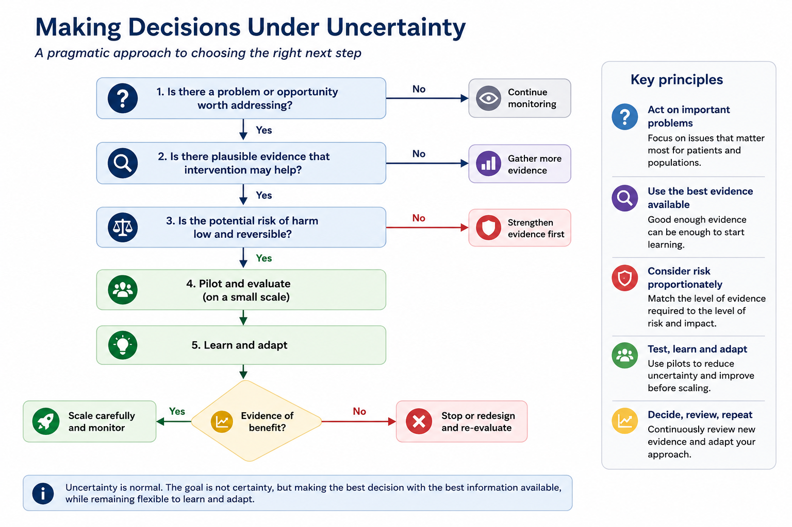

# Module 09: Risk, Probability & Uncertainty

## Learning Objectives

By the end of this module you should be able to:

* Understand the difference between risk, probability and certainty.
* Recognise common sources of uncertainty in healthcare data and analysis.
* Interpret risk estimates appropriately.
* Understand why decision-making often occurs despite uncertainty.
* Apply a pragmatic approach to making decisions when evidence is incomplete.

---

## Why This Matters

Healthcare leaders are rarely asked to make decisions with complete certainty.

Whether considering a new service model, investing in prevention, redesigning a pathway or implementing a digital solution, there will almost always be uncertainty about future outcomes.

The role of analytics is not to eliminate uncertainty.

The role of analytics is to help decision-makers understand uncertainty well enough to make better decisions.

Good decision-makers do not wait for certainty.

They make informed choices whilst understanding the risks.

---

## Risk Is Not Certainty

A common misunderstanding is to interpret risk estimates as predictions.

Risk describes the likelihood that something may happen.

It does not tell us what will happen for a specific patient, service or population.

For example:

| Risk Estimate | Interpretation |
|--------------|----------------|
| 80% risk of admission | More likely to occur than not |
| 50% risk of admission | Outcome remains highly uncertain |
| 20% risk of admission | Less likely, but still possible |

An 80% risk does not guarantee admission.

A 20% risk does not guarantee safety.

Risk describes probability, not destiny.

::: {.callout-note}
A useful question is:

*"How often would we expect this outcome to occur in a large group of similar people?"*

rather than

*"Will this individual definitely experience the outcome?"*
:::

---

## Sources of Uncertainty

Uncertainty exists in all healthcare analyses.

Common sources include:

* Random variation.
* Incomplete or missing data.
* Small sample sizes.
* Changes in clinical practice.
* Policy changes.
* Workforce changes.
* Behavioural responses to interventions.
* Unexpected external events.

The future rarely behaves exactly like the past.

This means forecasts should always be viewed as estimates rather than promises.

---

## Confidence Intervals

Analysts often report estimates together with a **95% confidence interval**.

Rather than providing a single value, confidence intervals recognise that every estimate contains some uncertainty.

For example:

| Estimated Readmission Rate | 95% Confidence Interval |
|----------------------------|-------------------------|
| 8.0% | 6.9% – 9.1% |

```text
6.9% ─────●───── 9.1%
          8%
```

The confidence interval provides a range of plausible values for the true underlying estimate.

Narrow confidence intervals indicate greater precision.

Wider confidence intervals indicate greater uncertainty.

For decision-makers, the important message is often not the exact estimate, but **how certain we are about that estimate.**

::: {.callout-note}
A useful question is:

*"How much uncertainty surrounds this estimate?"*

rather than

*"What is the exact number?"*
:::

---

## Error Bars

Many dashboards and reports include charts with small lines extending above and below a point or bar.

These are known as **error bars**.

Error bars provide a visual indication of uncertainty around an estimate.

Larger error bars suggest greater uncertainty.

Smaller error bars suggest greater precision.

Two organisations may appear to perform differently, but if their error bars overlap substantially, the apparent difference may simply reflect normal variation rather than a meaningful difference.

Error bars therefore encourage caution when comparing organisations or services.

```text
Hospital A

    ●
  ─────

Hospital B

    ●
──────────
```

They remind us that every estimate contains uncertainty.

---
## Interpreting a P-value

A p-value answers one question: Could this observed difference simply be due to chance?

```text
                    What does a p-value tell us?

            Observed difference between two groups
                           │
                           ▼
        Could this difference simply be due to chance?
                           │
          ┌────────────────┴────────────────┐
          │                                 │
     p < 0.05                         p ≥ 0.05
          │                                 │
          ▼                                 ▼
Unlikely to be                    Could reasonably be
explained by chance               explained by chance
          │                                 │
          └────────────────┬────────────────┘
                           ▼
Now ask:
* How large is the difference?
* How certain are we? (Confidence interval)
* Does the difference matter in practice?

```

```text
...
```
Analysts often report a **p-value** when comparing two groups or evaluating an intervention.

A p-value helps us judge whether an **observed difference is likely to be explained by chance alone**.

A commonly used threshold is:

| p-value | Interpretation |
|---------|----------------|
| **p < 0.05** | The observed difference is unlikely to be explained by chance alone. |
| **p ≥ 0.05** | The observed difference could reasonably be explained by chance. |

A p-value **does not prove** that a difference is real.

**It simply helps us judge whether the observed difference is likely to be more than random variation.**

::: {.callout-important}
## What a P-value Doesn't Tell Us

A p-value does **not** tell us:

* how large the difference is
* whether the difference is clinically or operationally important
* whether we should change practice

A very small difference can still have a low p-value if enough data are available.

Likewise, a result that is **not** statistically significant may still be important, particularly when studies are small or evidence is limited.
:::

::: {.callout-tip}
## Always Consider

When interpreting a p-value, also ask:

* How large is the difference?
* How certain are we? (Look at the confidence interval.)
* Does the difference matter in practice?
* What are the costs, benefits and risks?

> **Statistical significance does not necessarily imply practical importance.**
:::

### Example

A new intervention reduces hospital readmissions from **8.0% to 7.8%**.

The analysis reports:

> **p = 0.01**

**The analysis suggests the observed 0.2% reduction is unlikely to be explained by chance alone.**

However, it does **not** tell us whether a **0.2% reduction** is:

* clinically meaningful
* cost-effective
* sufficient to justify changing practice

Those decisions require consideration of the **size of the difference**, **confidence intervals**, **costs**, **risks** and the wider clinical context.

---

### Poor Interpretation

> "The p-value is greater than 0.05, so the intervention failed."

### Better Interpretation

> "The evidence is uncertain. We should also consider the size of the difference, the confidence interval, the sample size and the wider context."

---

### Poor Interpretation

> "The difference is statistically significant, therefore it is important."

### Better Interpretation

> **"The difference is unlikely to be due to chance, but is it large enough to justify changing practice or investing further resources?"**

---

### Poor Interpretation

> "The confidence intervals overlap, so there is definitely no difference."

### Better Interpretation

> "Confidence intervals help us understand uncertainty, but they should be interpreted alongside the size of the difference, study design and the wider body of evidence."

---

## Risk of Action vs Risk of Inaction

When considering change, organisations often focus heavily on the risks of doing something.

However, every decision involves two sets of risks.

### Risks of Action

* Financial cost.
* Opportunity cost.
* Implementation challenges.
* Unintended consequences.

### Risks of Inaction

* Continuing poor outcomes.
* Increasing demand pressures.
* Worsening inequalities.
* Missed opportunities for improvement.

Sometimes the greatest risk is doing nothing.

---

## Pragmatic Decision-Making Under Uncertainty

Not every decision requires the same level of evidence.

The level of evidence should be proportionate to the scale of risk.

| Decision Type | Typical Evidence Requirement |
|---------------|------------------------------|
| Minor operational change | Local data and professional judgement |
| Small pilot | Local evaluation and benchmarking |
| Significant investment | Formal evaluation and business case |
| System-wide transformation | Strong evidence and ongoing evaluation |

Waiting for perfect evidence can sometimes delay beneficial change unnecessarily.

---

## A Practical Decision Framework

When faced with uncertainty, consider the following questions:

1. What do we know?
2. What do we not know?
3. What assumptions are being made?
4. What are the potential benefits?
5. What are the potential harms?
6. What happens if we delay?
7. Can we test the idea before scaling?

In many situations the answer is not "implement" or "do not implement".

The answer is often:

> "Pilot, evaluate, learn and adapt."

---

## Decision-Making Under Uncertainty



---

## Poor Interpretation vs Better Interpretation

### Poor Interpretation

> "We don't know for certain that this will work, so we should wait."

### Better Interpretation

> "We have uncertainty, but do we have enough evidence to justify testing the intervention safely?"

---

### Poor Interpretation

> "The forecast says demand will increase by 15%."

### Better Interpretation

> "The forecast suggests demand may increase by around 15%, but there is uncertainty around that estimate."

---

### Poor Interpretation

> "The intervention might fail, so we shouldn't proceed."

### Better Interpretation

> "What are the risks of proceeding, and what are the risks of doing nothing?"

---

### Poor Interpretation

> "We need more data."

### Better Interpretation

> "Would additional data materially change our decision?"

---

## Questions Decision-Makers Should Ask

* What level of uncertainty exists in this analysis?
* How much uncertainty surrounds this estimate?
* Are the confidence intervals sufficiently narrow to support decision-making?
* Is the result statistically significant, and more importantly, is it practically meaningful?
* What assumptions underpin these findings?
* What information is missing or unknown?
* How sensitive are the conclusions to those assumptions?
* What are the risks of acting?
* What are the risks of not acting?
* Is there a lower-risk way to test this first?
* What evidence would increase our confidence?
* Are we delaying action because of genuine uncertainty or because we are seeking certainty that may never exist?
* Can we pilot, evaluate and adapt rather than committing to a full-scale implementation?

---

## Key Takeaways

* Risk is not certainty.
* Probability describes the likelihood of an event, not whether it will definitely occur.
* All analyses contain some degree of uncertainty.
* Confidence intervals communicate uncertainty around an estimate.
* Statistical significance does not necessarily imply practical importance.
* Forecasts and predictions should be interpreted as estimates rather than promises.
* Decisions should consider both the risks of action and the risks of inaction.
* Different decisions require different levels of evidence.
* Waiting for perfect information is itself a decision and may carry risks.
* Effective organisations acknowledge uncertainty, learn quickly and make proportionate decisions using the best evidence available at the time.

