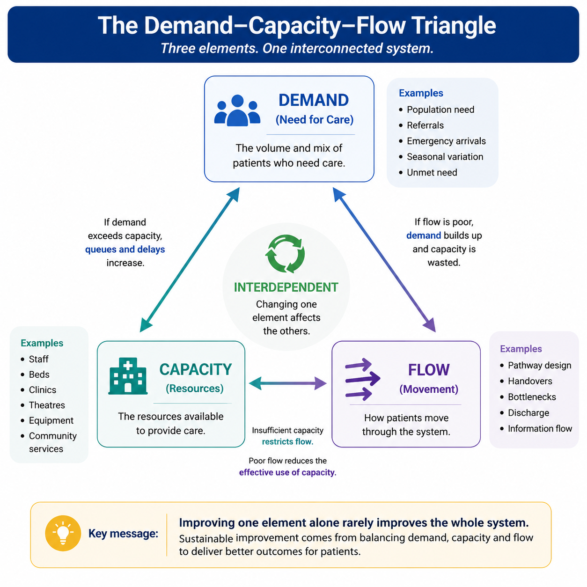
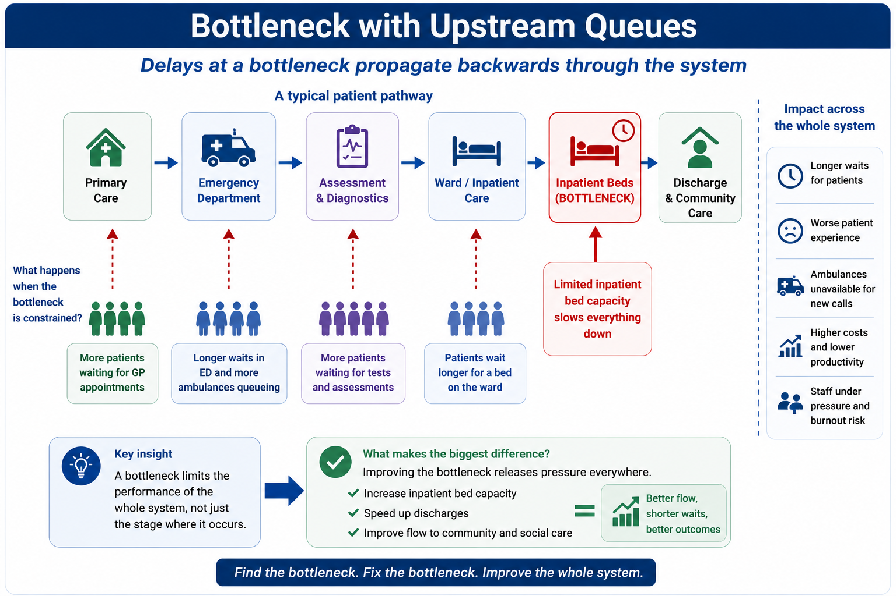
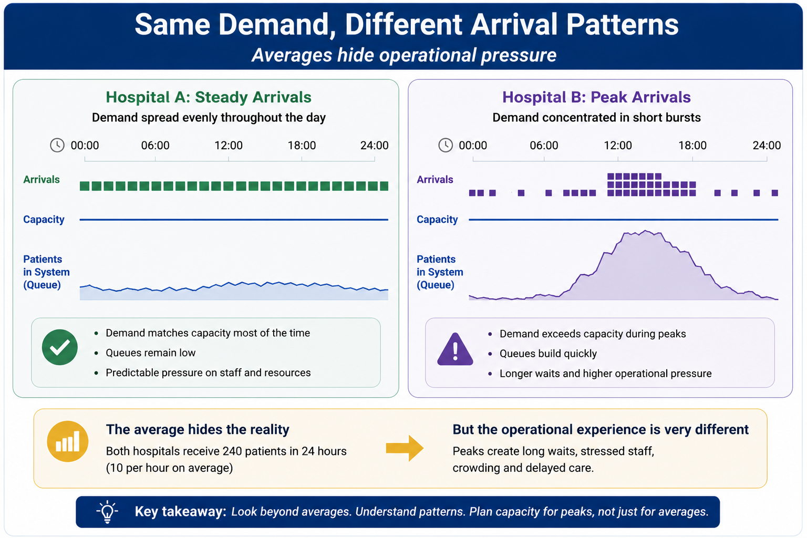
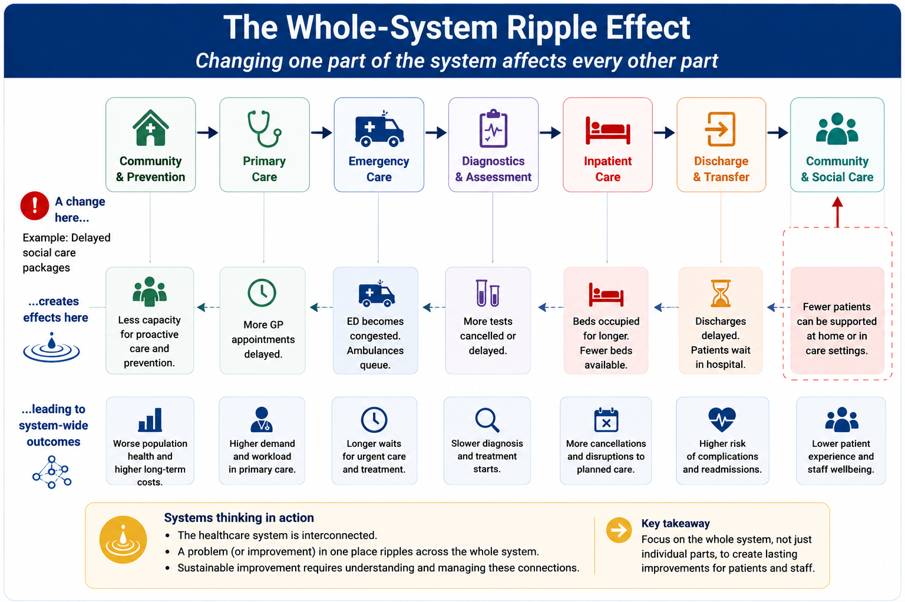

# Module 11: Demand, Capacity & Operational Flow

## Learning Objectives

By the end of this module you should be able to:

* Understand the relationship between demand, capacity and flow.
* Recognise why increasing demand does not always require increasing capacity.
* Appreciate how bottlenecks affect the performance of the entire healthcare system.
* Understand why averages often fail to describe operational performance.
* Recognise how variation creates queues and delays.
* Ask better questions when interpreting operational data.

---

# Why This Matters

Every healthcare organisation experiences pressure.

Emergency Departments become crowded.

Ambulances queue outside hospitals.

Elective waiting lists grow.

Patients experience delayed discharges.

It is tempting to assume these problems simply reflect insufficient capacity.

Sometimes they do.

But often they reflect something different:

> **How patients move through the healthcare system.**

Healthcare behaves as a connected system.

Improving one part of the pathway does not necessarily improve the whole pathway.

Understanding **demand**, **capacity** and **flow** explains why.

::: {.callout-important}
## The Central Message of This Module

Healthcare performance is rarely determined by **demand**, **capacity** or **flow** alone.

It emerges from the interaction between all three.

Understanding this interaction is fundamental to improving healthcare systems.
:::

---

# Demand, Capacity and Flow Are Interdependent

Healthcare systems perform well only when demand, capacity and flow are considered together.

Focusing on one element in isolation often moves pressure elsewhere rather than solving the underlying problem.

As shown in the figure below, each element continuously influences the others.

Demand, Capacity and Flow are interdependent. Sustainable improvement requires balancing all three components.

For example:

* increasing demand places greater pressure on available capacity
* poor flow reduces the effective use of existing capacity
* insufficient capacity creates delays that further reduce flow

Improving one component alone rarely produces sustainable improvement.

---

# Demand Is Not The Same As Activity

Demand represents the **need** for healthcare.

Activity represents the **care that is actually delivered.**

These are not always the same.

For example:

* patients waiting for appointments still contribute to demand
* delayed patients continue to consume capacity
* unmet need may never appear in operational data
* cancelled appointments reduce activity but not demand

Understanding this distinction is essential.

---

# Capacity Is More Than Beds and Staff

Capacity is often described simply as:

* staff
* beds
* clinics
* theatres

In reality, capacity also depends on:

* workforce availability
* diagnostics
* discharge processes
* community services
* social care
* digital infrastructure

A hospital with available beds but no discharge capacity is still constrained.

Similarly, additional staff cannot improve performance if another part of the system limits patient flow.

---

# Flow Is Where Systems Succeed or Fail

Patients move through a sequence of healthcare services rather than a single department.

Delays in one part of the pathway rarely remain isolated.

As illustrated in the figure below, delays at a bottleneck propagate backwards through the system, creating queues upstream.

Removing the bottleneck improves performance across the whole pathway.

Every handover introduces the potential for delay.

Healthcare therefore behaves as a connected network rather than a collection of independent departments.

---

# Bottlenecks

A bottleneck limits the performance of the entire system.

Imagine a motorway with four lanes narrowing to one.

Traffic builds long before the narrowing point.

Healthcare behaves similarly.

Common bottlenecks include:

* delayed diagnostics
* inpatient bed availability
* delayed discharge
* theatre capacity
* social care availability

Improving a non-bottleneck often has surprisingly little effect on overall performance.

Removing or reducing the bottleneck usually produces the greatest system-wide benefit.

---

# Why Averages Can Mislead Operational Decisions

Suppose two Emergency Departments each receive:

> **300 attendances per day**

The averages appear identical.

However:

* Hospital A receives patients steadily throughout the day.
* Hospital B receives large surges during the afternoon and evening.

As demonstrated in the figure below, both hospitals experience the same total demand, yet their operational experience is very different.

Two hospitals can experience very different operational pressures because of different arrival patterns.

Queues form because of **variation**, not simply because of average demand.

Operational pressure is often created by **patterns of demand**, rather than demand itself.

---

# Variation Creates Queues

Healthcare demand is rarely constant.

Patients do not arrive evenly.

Similarly:

* staff sickness varies
* discharge timing varies
* theatre utilisation varies
* ambulance arrivals vary
* diagnostic turnaround times vary

Small variations accumulate throughout the system.

Queues are therefore a natural consequence of variation.

Reducing unnecessary variation often improves patient flow without increasing capacity.

---

# High Utilisation Can Reduce Performance

Intuitively, high utilisation appears efficient.

However, systems operating continuously at maximum utilisation often become less resilient.

For example:

* fully occupied wards cannot absorb sudden admissions
* fully booked clinics have little flexibility
* operating theatres with no spare capacity struggle to recover from delays

Healthcare systems require spare capacity to cope with inevitable variation.

Maximising utilisation is therefore not always the same as maximising performance.

---

# A Whole-System Perspective

Healthcare behaves as a connected system.

Changes in one part of the pathway frequently have consequences elsewhere.

As illustrated in the figure below, improving one service may simply move pressure elsewhere unless the wider system is considered.

Healthcare behaves as a connected system. Changes in one part of the pathway create ripple effects across the wider healthcare system.

Problems originating outside hospital—such as reduced community capacity or delayed social care—can rapidly affect:

* Emergency Departments
* inpatient wards
* ambulance services
* elective care

Understanding these ripple effects is essential when designing improvement programmes.

---

# Why This Matters for Decision-Makers

Many operational problems cannot be solved simply by increasing resources.

Sometimes organisations achieve greater improvement by:

* redesigning pathways
* removing bottlenecks
* reducing unnecessary variation
* improving discharge processes
* strengthening community services
* improving patient flow

The key question is often not:

> **"Where should we add more capacity?"**

Instead it is:

> **"What is preventing patients flowing through the system?"**

::: {.callout-tip}
## Remember

Improving one part of the system rarely improves the whole system.

Sustainable improvement comes from understanding how **demand**, **capacity** and **flow** interact across the entire healthcare pathway.
:::

---

# Key Takeaways

* Demand and activity are not the same.
* Capacity extends beyond beds and staffing.
* Flow determines how effectively healthcare systems operate.
* Bottlenecks affect the entire pathway.
* Variation creates queues.
* High utilisation is not always efficient.
* Improving non-bottlenecks often has limited impact.
* Whole-system thinking is usually more valuable than optimising individual departments.

---

# Questions Decision-Makers Should Ask

* Are we measuring demand or activity?
* Is our constraint really capacity, or is it poor flow?
* Where are patients actually waiting?
* Which bottleneck is limiting overall system performance?
* Are averages hiding important patterns of demand?
* Could improving flow release more capacity than adding additional resources?
* How might changes in one part of the pathway affect another?
* Are we optimising individual services or improving the whole system?
* What unintended consequences might this change create elsewhere in the system?
