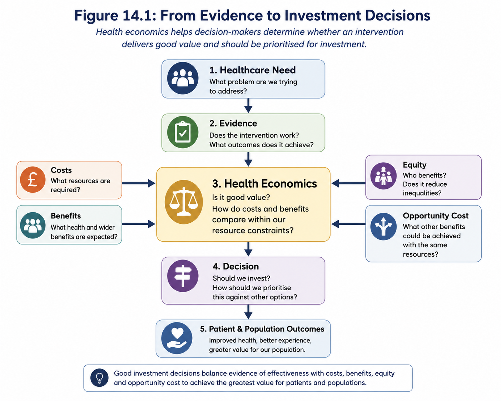

# Module 14: Health Economics & Value in Healthcare Decision-Making

## 1. Why Health Economics Matters

Throughout the previous module we explored how healthcare pathways can be understood, redesigned, implemented and evaluated.

Evaluation helps us answer an important question:

> **Did the intervention improve outcomes?**

However, demonstrating that an intervention works is only part of the decision.

Healthcare organisations operate with limited financial resources, finite workforce capacity and competing priorities. Every investment made in one area inevitably means that fewer resources are available elsewhere.

Decision-makers therefore face a more challenging question:

> **Which option delivers the greatest value for patients and populations within the resources available?**

Health economics provides a structured way of answering that question.

Rather than focusing solely on costs, health economics considers the relationship between the resources invested and the outcomes achieved.

Its purpose is to help healthcare organisations make better decisions by comparing alternative ways of improving health, reducing inequalities and making the best use of limited resources.

*Figure 14.1: Evidence that an intervention works is only the beginning. Decision-makers must also consider costs, benefits, value and whether limited resources could achieve greater impact elsewhere.*

::: {.callout-important collapse="false"}
## Key Principle

An intervention that improves outcomes is not automatically the best investment.

Healthcare organisations must consider both **effectiveness** and **value** when deciding how to allocate limited resources.
:::

### Why This Matters

Every day, healthcare organisations make investment decisions.

Examples include:

- expanding diagnostic services
- recruiting additional staff
- investing in digital technology
- redesigning healthcare pathways
- introducing new medicines
- expanding community services
- funding preventative programmes.

Most organisations cannot fund every worthwhile initiative.

Choices therefore need to be made.

Health economics provides a transparent framework for comparing those choices using evidence rather than assumptions.

### Health Economics Is Not About Cutting Costs

One of the most common misconceptions is that health economics is primarily concerned with reducing expenditure.

In reality, health economics is concerned with **maximising value**.

Sometimes the lowest-cost option represents poor value because it delivers inferior outcomes.

Equally, a more expensive intervention may provide substantially greater benefits, prevent future illness or reduce demand elsewhere in the healthcare system.

Good health economics therefore seeks to maximise health gain, patient experience and equity for the resources available rather than simply minimise expenditure.

### Building on Previous Modules

This module builds directly on concepts introduced earlier in this series.

Modules 7 and 8 explored how interventions can be evaluated using robust evidence.

Module 13 demonstrated how healthcare pathways can be redesigned, implemented and evaluated.

Health economics adds another perspective by asking:

- Which redesign delivers the greatest value?
- Are the additional benefits worth the additional costs?
- Could limited resources produce greater benefit if invested elsewhere?

These questions help decision-makers move from understanding **whether something works** to deciding **whether it should be funded, expanded or prioritised**.

::: {.callout-tip collapse="false"}
## Decision-Maker Questions

Before approving an investment, ask yourself:

- Does the intervention improve outcomes?
- What additional resources are required?
- What benefits are expected for patients and populations?
- Could the same resources produce greater benefit elsewhere?
- Are we considering long-term value as well as short-term costs?
- How will we judge whether this investment represents good value?
:::
